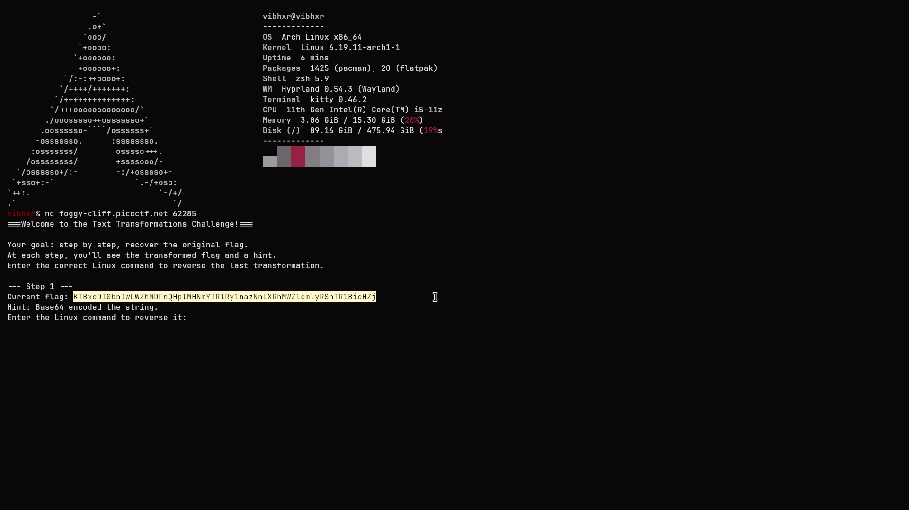
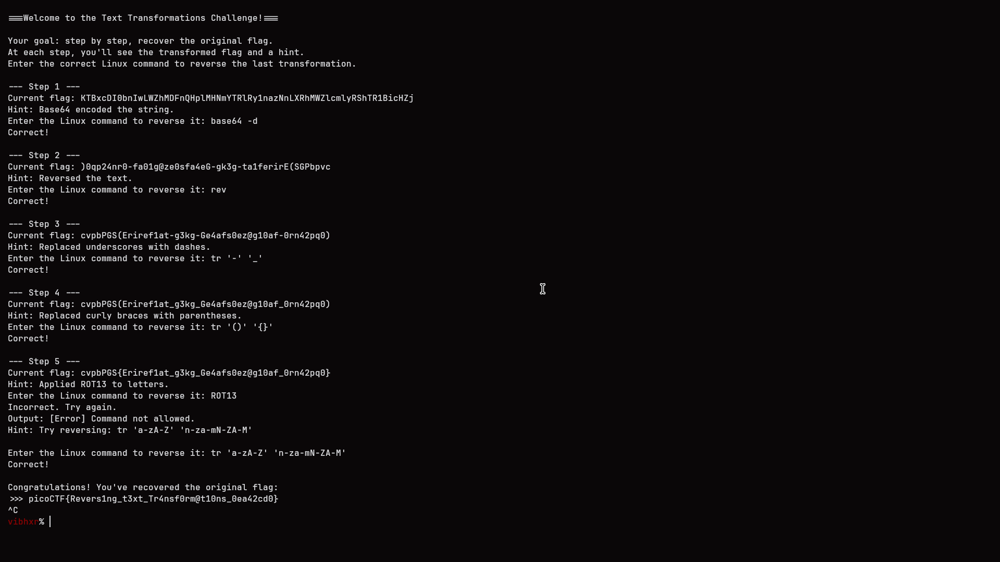

# Text Transformations

## Challenge Info

- **Category**: General Skills
- **Difficulty**: Easy-Medium
- **Concepts**: Linux CLI, Encoding/Decoding, String Manipulation
- **Status**: Compromised ✓

## Description

The "Text Transformations" challenge is an interactive exercise that requires the user to reverse a series of text manipulations applied to a flag. By connecting to a remote server via `netcat`, the user is presented with several layers of encoding and character transformations (Base64, reversal, character substitution) that must be undone step-by-step using standard Linux utilities.

## Solution

The challenge was hosted on a remote server accessible via `nc foggy-cliff.picoctf.net 62285`.



### Step 1: Base64 Decoding
The first layer was a Base64 encoded string. The hint explicitly pointed to Base64.
- **Transformation**: Readable text → `KTBx...`
- **Reversal Command**: `base64 -d`

### Step 2: String Reversal
The resulting text from the previous step was reversed.
- **Transformation**: Text reversed
- **Reversal Command**: `rev`

### Step 3: Character Substitution (Dash to Underscore)
The next layer involved character translation where underscores had been replaced with dashes.
- **Transformation**: `_` replaced with `-`
- **Reversal Command**: `tr '-' '_'`

### Step 4: Character Substitution (Parentheses to Braces)
The final transformation replaced the standard flag braces `{}` with parentheses `()`.
- **Transformation**: `{}` replaced with `()`
- **Reversal Command**: `tr '()' '{}'`

## Final Pipeline

The entire transformation process can be summarized in a single command pipeline to recover the flag from the initial encoded string:

```bash
echo "KTBx..." | base64 -d | rev | tr '-' '_' | tr '()' '{}'
```

### Resulting Flag
Upon completing the final reversal step, the flag was revealed:
`picoCTF{Revers1ng_t3xt_Tr4nsf0rm@t10ns_0ea42cd0}`



## The Real Lesson

This challenge emphasizes the power of the Linux command line as a data processing pipeline. Understanding how to chain small, specialized tools (`base64`, `rev`, `tr`) allows a security researcher to efficiently handle complex encoding and data manipulation tasks.

**Key Takeaways**:
- **Data Pipelines**: Mastering the use of pipes (`|`) to pass data between specialized tools is fundamental in security automation and reverse engineering.
- **Encoding vs. Encryption**: Always distinguish between simple encoding (like Base64) which is intended for data portability, and true encryption. Encoding is not a security measure.
- **Systematic Reversal**: When dealing with multi-layer transformations, a systematic, step-by-step approach is the most reliable way to identify and reverse each layer.

## Tools Used

- **nc (netcat)**: For network communication with the challenge server.
- **base64**: For decoding standard Base64 data.
- **rev**: For reversing the order of characters in a string.
- **tr**: For character translation and substitution.

---

*Writeup by Vibhor Prasad | Security Assessment Division*
