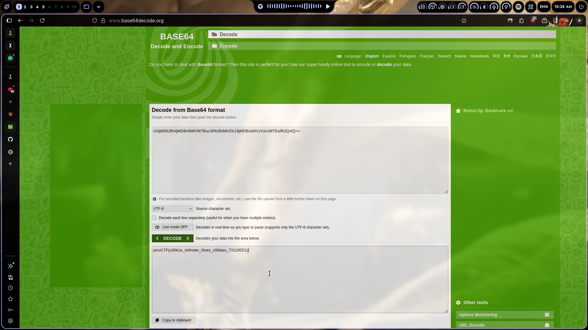

# Cookie

## Challenge Info

- **Category**: Web Exploitation
- **URL**: `http://wily-courier.picoctf.net:50948/`
- **Points**: Easy
- **Severity**: Medium
- **Status**: Compromised ✓

## Description

This assessment focuses on a web application that manages user preferences through cookie-based indexing. The objective was to identify if these indices could be manipulated to access unauthorized data.

## Solution

### Step 1: Identifying the State Mechanism
The application features a simple search bar. Entering "snickerdoodle" resulted in a successful response and the creation of a session cookie: `name=0`. This indicated that the application uses a numeric index to track which "cookie" the user is viewing.

### Step 2: Testing for IDOR
By manually modifying the cookie value to `name=1` and reloading the page, the application displayed a different cookie type ("chocolate chip"). This confirmed an **Insecure Direct Object Reference (IDOR)** vulnerability: the server blindly trusts the client-provided index to fetch data from the backend.

### Step 3: Enumeration and Exploitation
As a tester, the logical next step was to enumerate these indices to find any hidden or administrative records. I used a brief automated sweep to iterate through the cookie values.

### Step 4: Capturing the Flag
Upon reaching index `18` (`name=18`), the application stopped returning standard cookie names and instead exposed the administrative flag.

**Flag**: `picoCTF{3v3ry1_l0v3s_c00k135_a4dadb49}`

## The Real Lesson

This lab is a textbook example of why **predictable identifiers** should never be used for access control. When an application uses simple integers to reference objects, it becomes trivial for an attacker to "walk" the database.

**Remediation**:
- Always use non-predictable, high-entropy tokens (like UUIDs) for session management.
- Implement robust server-side authorization checks to ensure a user is actually permitted to view the object they are requesting.
- Treat all client-side data (including cookies) as untrusted input.

## Tools Used
- Browser Developer Tools
- `curl` for session enumeration
- Custom Bash automation

---
*Writeup by Vibhor Prasad | Security Assessment Division*
