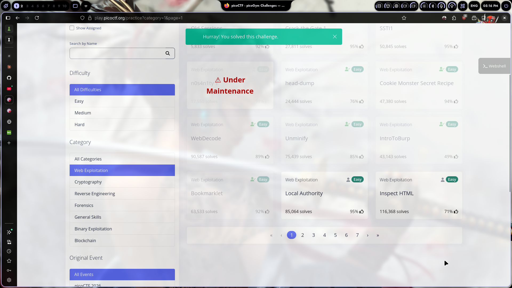
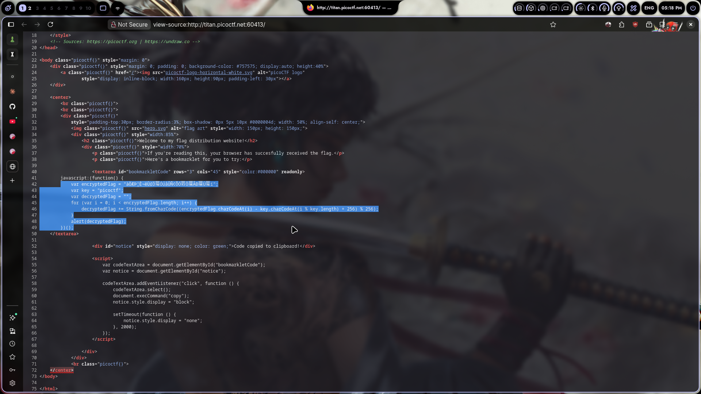

# Bookmarklet

## Challenge Info

- **Category**: Web Exploitation
- **URL**: `http://titan.picoctf.net:60413`
- **Points**: Easy

## Description

The challenge gives us a "flag distribution website" that includes a bookmarklet to try. The page says "If you're reading this, your browser has successfully received the flag." The bookmarklet contains JavaScript code that supposedly decrypts and displays the flag.

## Solution

### Step 1: Open the Challenge
Went to the URL. Saw a basic page with some hero art and a `<textarea>` containing JavaScript code. The page mentions the flag is already in the browser and gives us a bookmarklet to "try."

### Step 2: View Page Source
Right-clicked → **View Page Source** (or `Ctrl+U`). Found the bookmarklet code inside a `<textarea>` around line 41-48:

```javascript
var encryptedFlag = "àO&PjE-eÜEÖÜÚÀNCÔÕÇYÖAÐÄÒËI";
var key = "picoctf";
var decryptedFlag = "";
for (var i = 0; i < encryptedFlag.length; i++) {
    decryptedFlag += String.fromCharCode((encryptedFlag.charCodeAt(i) - key.charCodeAt(i % key.length) + 256) % 256);
}
alert(decryptedFlag);
```

### Step 3: Understand the Encryption
The code reveals a simple **XOR-style cipher** (actually subtraction-based):
- Each character of `encryptedFlag` is decrypted by subtracting the corresponding character of the repeating key `"picoctf"`
- The `+ 256) % 256` wraps around negative results

### Step 4: Run the Decryption
Pasted the entire script into the browser console (DevTools → `F12` → Console tab) and hit Enter:

```javascript
var encryptedFlag = "àO&PjE-eÜEÖÜÚÀNCÔÕÇYÖAÐÄÒËI";
var key = "picoctf";
var decryptedFlag = "";
for (var i = 0; i < encryptedFlag.length; i++) {
    decryptedFlag += String.fromCharCode((encryptedFlag.charCodeAt(i) - key.charCodeAt(i % key.length) + 256) % 256);
}
alert(decryptedFlag);
```

An `alert()` popup appeared with the flag:

```
picoCTF{b00km4rkl3t_3ncrypt10n_4d3c0d3d}
```

### Step 5: Flag Submitted
Copied and submitted. Done.



## The Real Lesson

This is client-side encryption — and it's worthless for hiding secrets. The key and the algorithm are both right there in the page source. In real pentests, I've seen:
- AES keys hardcoded in JavaScript files
- Encryption logic shipped to the browser where anyone can reverse it
- "Obfuscated" client-side code that's just a `eval()` away from readable
- Crypto implemented in JS that's trivially reversible

**Rule of thumb:** If the browser can decrypt it, the user can decrypt it. Never trust client-side encryption for secrets.

## Tools Used

- Browser View Source (`Ctrl+U`)
- Browser DevTools Console (`F12`)

## Screenshot



---

*Writeup by vibhxr | 2-3 years deep in pentesting, still learning every day*

## Alternative Solution

You can also solve this entirely from the command line without opening a browser:


