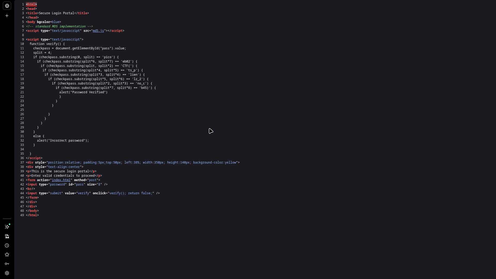
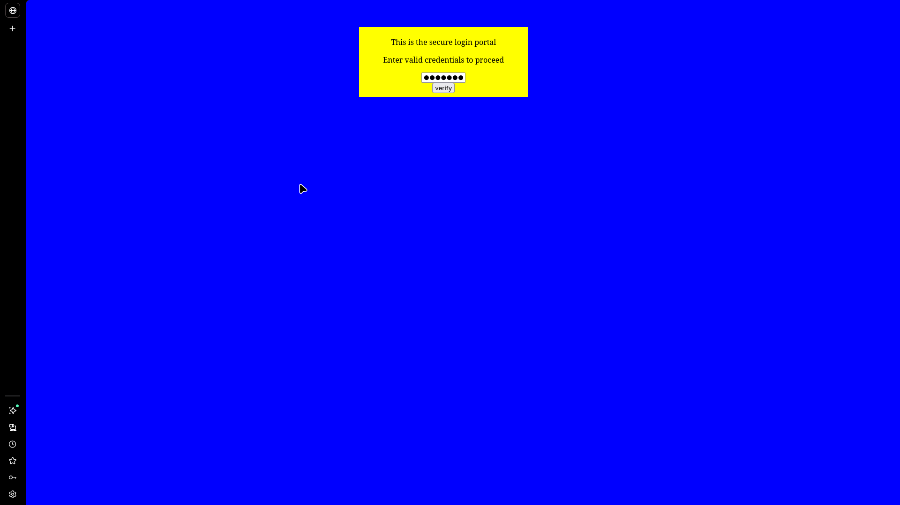
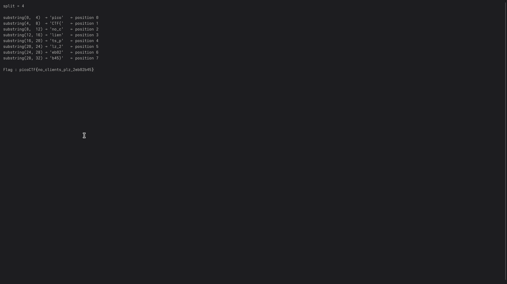

# dont-use-client-side

## Challenge Info

- **Category**: Web Exploitation
- **URL**: `http://fickle-tempest.picoctf.net:58455`
- **Points**: Easy
- **Severity**: Medium
- **Status**: Compromised ✓

## Executive Summary

During a security assessment of the "Secure Login Portal," a critical authentication bypass vulnerability was identified. The application relies exclusively on client-side JavaScript for credential verification. Since client-side code is fully accessible to the user, an attacker can trivially reverse-engineer the verification logic to retrieve the hardcoded credentials (the flag). 

**Key Finding**: The application implements "security through cosmetic obfuscation," where a hardcoded flag is split and checked in a non-linear order within the browser, providing no actual security against manual source code inspection.

## Challenge Analysis

The landing page presents a "Secure Login Portal" with a simple password input field.



Initial reconnaissance suggested that the application was a static site. The challenge hint, "Never trust the client," strongly indicated that the security boundary was misplaced on the frontend.

## Vulnerability Explanation

### Client-Side Authentication Bypass
The core vulnerability lies in the fact that the server does not perform any backend validation. When a user clicks "verify," the browser executes a local JavaScript function `verify()`. This function contains the logic to determine if a password is correct. Because the browser must download this script to execute it, the "secret" it is checking against is inherently public knowledge.

## Solution / Methodology

### Step 1: Source Code Inspection
Using browser developer tools (Ctrl+U), the HTML source was examined. An inline script was discovered containing the `verify()` function.



### Step 2: Code Breakdown
The verification logic uses the `.substring()` method to check parts of the input against hardcoded strings. The developer tried to obscure the flag by checking chunks in a non-sequential order:

```javascript
if (checkpass.substring(0, split) == 'pico') { // Chunk 0
    if (checkpass.substring(split*6, split*7) == 'eb02') { // Chunk 6
        if (checkpass.substring(split, split*2) == 'CTF{') { // Chunk 1
            // ... and so on
```

### Step 3: De-obfuscation & Reconstruction
To recover the flag, I mapped each `substring()` call to its corresponding index in the final string (where each chunk is 4 characters long):

- **Index 0 (0-4)**: `pico`
- **Index 1 (4-8)**: `CTF{`
- **Index 2 (8-12)**: `no_c`
- **Index 3 (12-16)**: `lien`
- **Index 4 (16-20)**: `ts_p`
- **Index 5 (20-24)**: `lz_2`
- **Index 6 (24-28)**: `eb02`
- **Index 7 (28-32)**: `b45}`



### Step 4: Final Flag Recovery
By assembling the chunks in order (0 through 7), the complete flag was retrieved:
`picoCTF{no_clients_plz_2eb02b45}`

## The Real Lesson

This challenge is a foundational lesson in web security architecture: **Never trust the client.**

**Key Learnings**:
1.  **Placement of Logic**: Authentication is a server-side responsibility. Any secret or verification logic sent to the client should be considered compromised by design.
2.  **Obfuscation is not Security**: Reordering code paths or splitting strings does not provide confidentiality. Plaintext data remains plaintext even if it's "scrambled" in a visible script.
3.  **The Client is an Adversary**: In security modeling, the client's environment is untrusted. Security controls must be enforced on the server where the user has no direct control over the execution environment.

## Remediation Recommendations

1.  **Implement Server-Side Auth**: Move all credential verification to a secure backend (e.g., Node.js, Python, PHP).
2.  **Use Secure Protocols**: Credentials should be submitted via `POST` requests over HTTPS and verified against a hashed/salted database entry.
3.  **Sanitize Frontend Code**: Ensure no sensitive metadata, internal comments, or administrative logic is leaked in client-side bundles.

## Tools Used
- Browser (View Page Source)
- Manual Code Analysis

---

*Writeup by Vibhor Prasad | Security Assessment Division*
