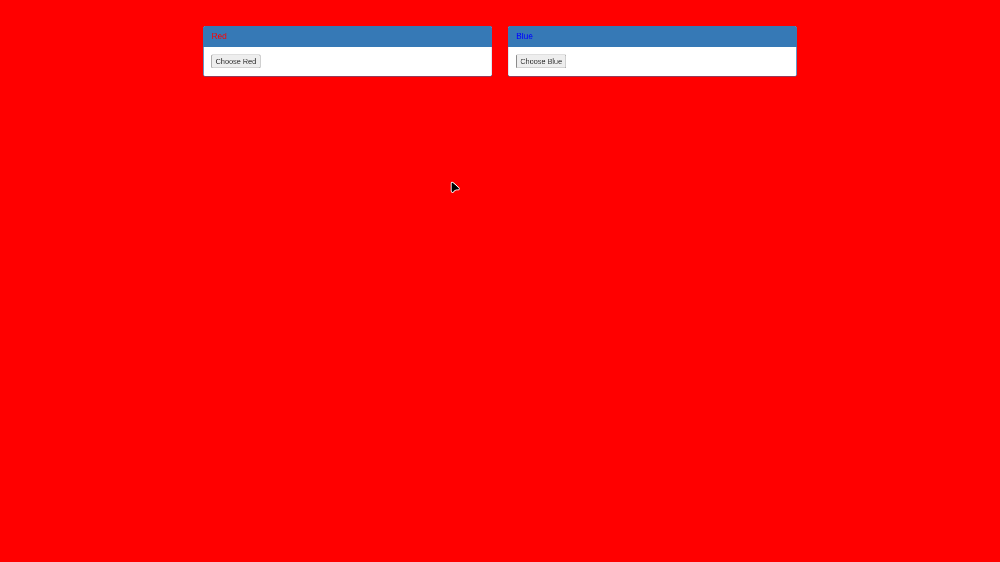
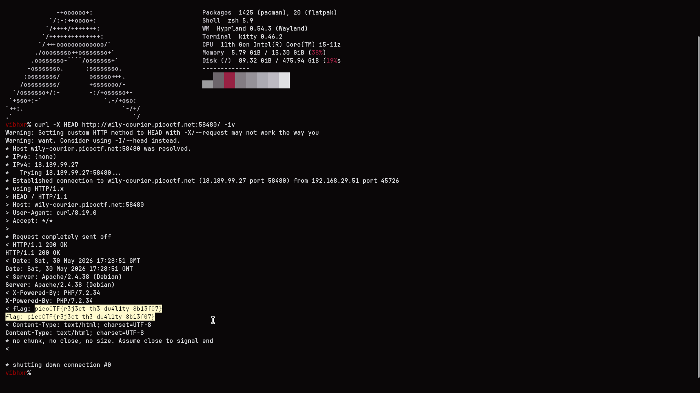

# Reject the Duality (GET aHEAD)

## Challenge Info

- **Category**: Web Exploitation
- **URL**: `http://wily-courier.picoctf.net:58480/`
- **Points**: Easy
- **Severity**: Low
- **Status**: Compromised ✓

## Executive Summary

During a security assessment of the "GET aHEAD" application (Reject the Duality), an information disclosure vulnerability was identified. The application utilizes a non-standard HTTP method (HEAD) to transmit sensitive information (the flag) within a custom response header. Standard user interaction through `GET` and `POST` requests—presented as a binary choice on the landing page—failed to reveal this data, highlighting the importance of inspecting all HTTP verb responses during an assessment.

## Challenge Analysis

The landing page presents the user with two distinct choices: "Red" and "Blue".



Initial observation suggested a binary state (duality). However, the challenge description "get ahead of the competition" and hints about "more than 2 choices" strongly implied that the vulnerability was not within the page content itself, but rather in the communication protocol (HTTP) used to serve the page.

## Vulnerability Explanation

### Custom HTTP Response Headers
The server was configured to respond to the `HEAD` HTTP method with a custom header named `flag:`. Standard browser behavior typically involves `GET` (retrieving the page) or `POST` (submitting data). The `HEAD` method is identical to `GET` except that the server must NOT return a message-body in the response. It is often used for testing hypertext links for validity, accessibility, and recent modification.

In this instance, the developer improperly used this "hidden" channel to store sensitive data, assuming standard users would not inspect the verbose header output.

## Methodology & Solution Walkthrough

### Step 1: Protocol Reconnaissance
The challenge description "get ahead" served as a linguistic hint pointing toward the **HEAD** HTTP verb. The hint "more than 2 choices" confirmed that we needed to look beyond the standard `GET` and `POST` methods.

### Step 2: Sending a HEAD Request
Using `curl`, a `HEAD` request was dispatched to the target server. The `-I` (or `--head`) flag was used to fetch only the headers, and `-v` (verbose) was used to inspect the full connection details.

```bash
curl -X HEAD http://wily-courier.picoctf.net:58480/ -iv
```

### Step 3: Flag Extraction
Upon inspecting the response headers returned by the server, a custom header was identified containing the flag.



- **Finding**: `flag: picoCTF{r3j3ct_th3_du4l1ty_8b13f07}`

## Impact Assessment

- **Confidentiality**: **High**. Sensitive data (the flag/token) is exposed to anyone capable of sending a non-standard HTTP request.
- **Integrity**: **Low**. No direct impact on data integrity.
- **Availability**: **Low**. No impact on system availability.

## The Real Lesson

This challenge highlights a common misconception in web development: that data not visible in the HTML body is "hidden" or secure.

**Key Learnings**:
1.  **Inspect All Channels**: Security assessments must include the inspection of HTTP response headers, cookies, and metadata, not just the rendered DOM.
2.  **Verb Analysis**: Servers may behave differently depending on the HTTP method used (`HEAD`, `OPTIONS`, `PUT`, `DELETE`). Automated scanners often overlook these unless specifically configured.
3.  **No Security by Obscurity**: Hiding secrets in headers is a form of obscurity, not security.

## Remediation Recommendations

1.  **Remove Sensitive Headers**: Developers should ensure that custom headers used for debugging or internal tracking are stripped from production responses.
2.  **Strict Method Handling**: Configure the web server or application framework to only respond to necessary HTTP methods. If `HEAD` is not required for the application's functionality, it should be disabled or sanitized.
3.  **Sanitize Response Metadata**: Regularly audit the server's response headers (`Server`, `X-Powered-By`, etc.) to prevent technology stack leakage.

## Tools Used

- **curl**: For sending crafted HTTP requests and inspecting headers.
- **Linux CLI**: For command-line execution and data parsing.

---

*Writeup by Vibhor Prasad | Security Assessment Division*
