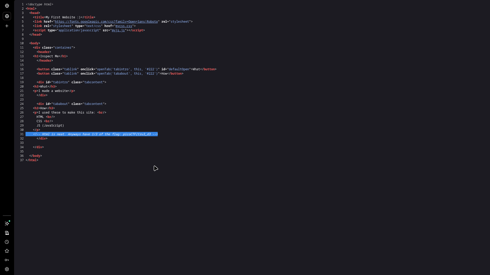
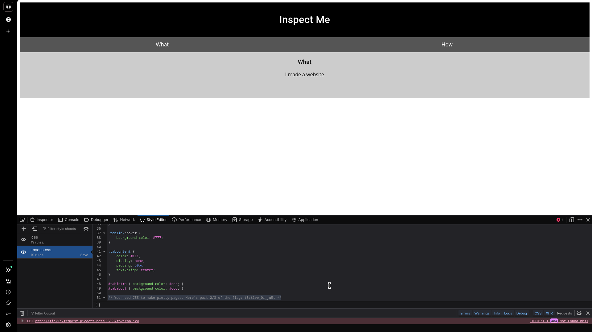
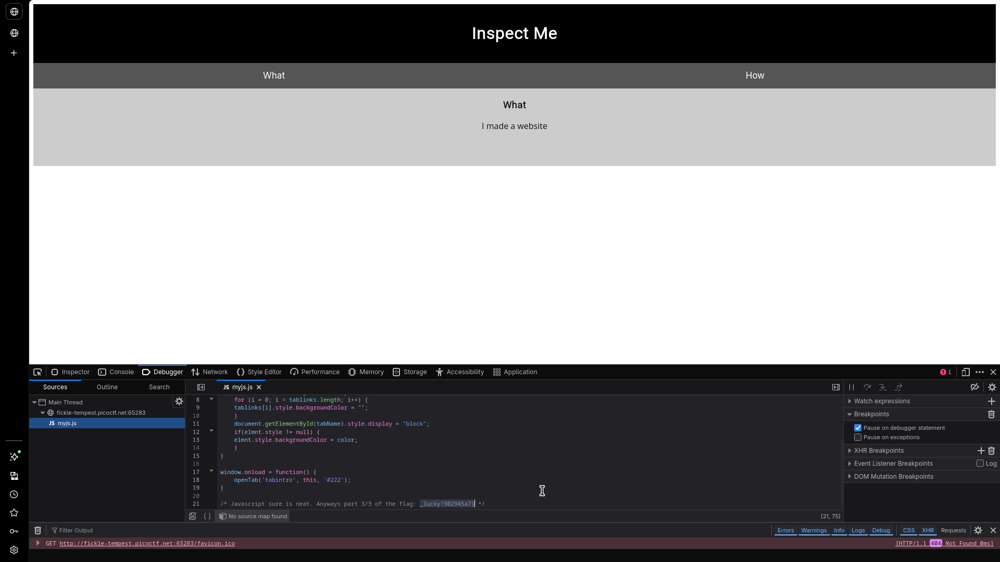

# Insp3ct0r

## Challenge Info

- **Category**: Web Exploitation
- **URL**: `http://fickle-tempest.picoctf.net:65283`
- **Points**: Easy
- **Severity**: Low
- **Status**: Compromised ✓

## Executive Summary

During a baseline security assessment of the "Inspect Me" web application, an information disclosure vulnerability was identified. The application leaks sensitive data (the flag) through source code comments embedded in client-side resources. The data is split across three distinct files: the HTML landing page, the primary CSS stylesheet, and the main JavaScript file. This finding highlights a failure in the production deployment process, where development-time comments were not stripped before the site was made public.

**Key Finding**: The flag is exposed in plaintext across three separate client-side files, discoverable via simple manual source code inspection.

## Challenge Analysis

The landing page is a simple static site with "What" and "How" tabs.

The challenge description and hints ("How do you inspect web code?", "There's 3 parts") explicitly pointed toward a reconnaissance-focused task involving the browser's inspection tools.

## Vulnerability Explanation

### Information Disclosure via Source Code Comments
Source code comments (`<!-- -->`, `/* */`, `//`) are a standard feature for developer documentation. However, when these comments remain in production code, they can leak internal logic, server-side paths, or—as seen here—sensitive credentials and tokens. Since the browser must download the full HTML, CSS, and JS files to render the page, any data within those files is public.

## Solution / Methodology

### Step 1: HTML Inspection (Part 1/3)
I began by viewing the page source (`Ctrl+U`) of the main URL. At the bottom of the HTML, the first segment of the flag was discovered in a comment.

- **Fragment**: `picoCTF{tru3_d3`

### Step 2: CSS Analysis (Part 2/3)
Next, I identified the linked stylesheet from the HTML head: `<link rel="stylesheet" type="text/css" href="style.css">`. Accessing the file directly revealed the second segment.

- **Fragment**: `t3ct1ve_0r_ju5t`

### Step 3: JavaScript Analysis (Part 3/3)
Finally, I examined the linked script file: ``. The third and final segment was found at the end of the script.

- **Fragment**: `_lucky?302945a7}`

### Step 4: Flag Reconstruction
Concatenating the three discovered fragments yields the complete flag:
`picoCTF{tru3_d3t3ct1ve_0r_ju5t_lucky?302945a7}`

## The Real Lesson

This challenge is a reminder that **client-side code is public by definition**.

**Key Takeaways**:
1.  **Deployment Hygiene**: Always use build tools (minifiers, obfuscators) to strip comments and internal metadata from production assets.
2.  **Audit Static Assets**: Periodically review the `Sources` tab in Browser DevTools to ensure no sensitive files or notes are being served to the user.
3.  **Secrets Management**: Never use source code comments for anything other than non-sensitive documentation.

## Remediation Recommendations

1.  **Implement Minification**: Use tools like Webpack, Gulp, or specialized minifiers (Terser, CSSO) to automatically remove comments during the build process.
2.  **Code Review**: Incorporate manual and automated checks (e.g., `grep` for sensitive keywords) before merging code into the production branch.
3.  **Harden File Serving**: Configure the server to only serve required files and avoid exposing internal structure or metadata.

## Tools Used
- Browser DevTools (Sources Tab)
- Manual Code Inspection

---

*Writeup by Vibhor Prasad | Security Assessment Division*
