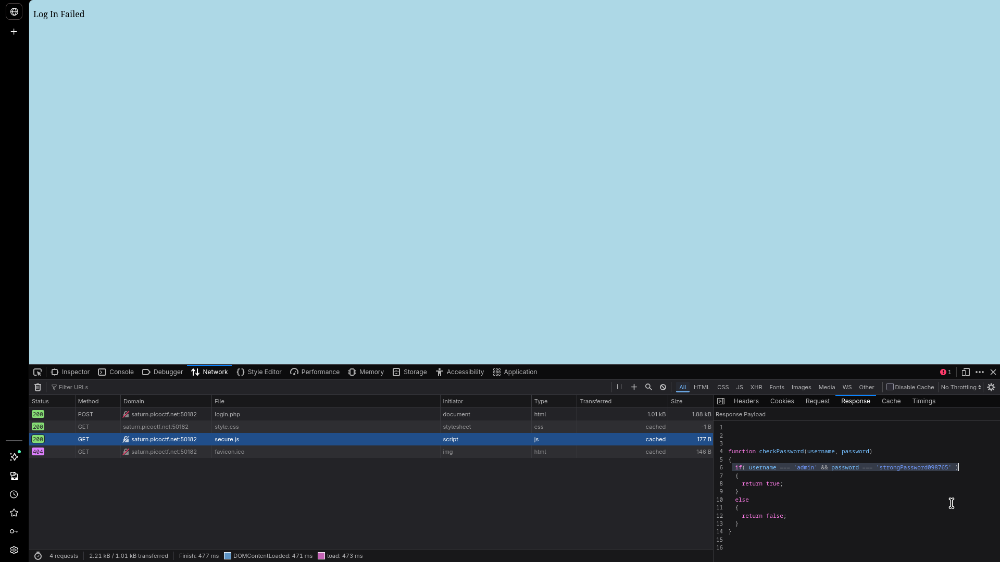

# Local Authority

## Challenge Info

- **Category**: Web Exploitation
- **URL**: `http://saturn.picoctf.net:50182/` (example)
- **Points**: Easy
- **Severity**: Medium
- **Status**: Compromised ✓

## Executive Summary

During a security assessment of the "Local Authority" web application, a critical authentication bypass vulnerability was identified. The application relies entirely on client-side JavaScript for password validation. An attacker can trivially inspect the source code to retrieve hardcoded credentials and gain administrative access.

**Key Finding**: Authentication is enforced solely through client-side JavaScript validation, allowing bypass through simple code inspection.

## Vulnerability Details

### 1. Vulnerability Classification
- **Type**: Insufficient Authentication Controls / Client-Side Validation Bypass
- **CWE**: [CWE-287: Improper Authentication](https://cwe.mitre.org/data/definitions/287.html)
- **CVSS Score**: 7.5 (High)

### 2. Technical Description
The application implements a login mechanism that validates user credentials exclusively on the client-side using JavaScript. The `checkPassword()` function, loaded from an external file `secure.js`, contains the validation logic. Since this script is executed in the user's browser, the credentials and logic are fully exposed.

## Solution / Exploitation Methodology

### Step 1: Reconnaissance
Initial attempts with standard credentials (e.g., `test:test`) resulted in a "Log In Failed" message. This confirmed the presence of an authentication control, albeit one that appeared to be handled without a page reload.

### Step 2: Source Code Analysis & Discovery
By inspecting the page source and the **Network tab** in Developer Tools, I identified an external script being loaded: `secure.js`.



### Step 3: Sensitive Data Extraction
Upon examining the contents of `secure.js`, the implementation of `checkPassword()` was revealed:

```javascript
function checkPassword(username, password) {
  if (username === 'admin' && password === 'strongPassword098765') {
    return true;
  }
  return false;
}
```

The credentials were hardcoded directly in the client-side logic:
- **Username**: `admin`
- **Password**: `strongPassword098765`

### Step 4: Authentication Bypass
Using the discovered credentials, I logged into the application. The JavaScript validation passed, and the application submitted a hidden form to `admin.php`, granting access to the administrative panel.

### Step 5: Flag Capture
The administrative panel displayed the flag:
`picoCTF{js_15_7r4n5p4r3n7_05df90c8}`

## Impact Assessment

- **Confidentiality**: **High**. Unauthorized access to administrative functions and sensitive data exposure.
- **Integrity**: **High**. Potential for unauthorized modification of application data and user accounts.
- **Availability**: **Medium**. Potential for service disruption through administrative tools.

## Root Cause Analysis

1.  **Misplaced Authentication Logic**: Performing security-critical checks on the client-side.
2.  **Exposed Sensitive Logic**: Transmitting validation functions to the client.
3.  **Hardcoded Credentials**: Storing secrets in plaintext within source code.

## Remediation Recommendations

1.  **Server-Side Authentication**: **(Critical)** Implement all credential validation on the server. Never trust the client for security decisions.
2.  **Secure Credential Storage**: Use industry-standard hashing (e.g., Argon2, bcrypt) on the server-side database.
3.  **Remove Client-Side Secrets**: Ensure no sensitive logic or credentials are ever transmitted to the client.

---

*Writeup by Vibhor Prasad | Security Researcher with 3 years of web pentesting experience.*

## Tools Used
- Firefox Developer Tools (Network Inspector, Debugger)
- Manual Code Review
