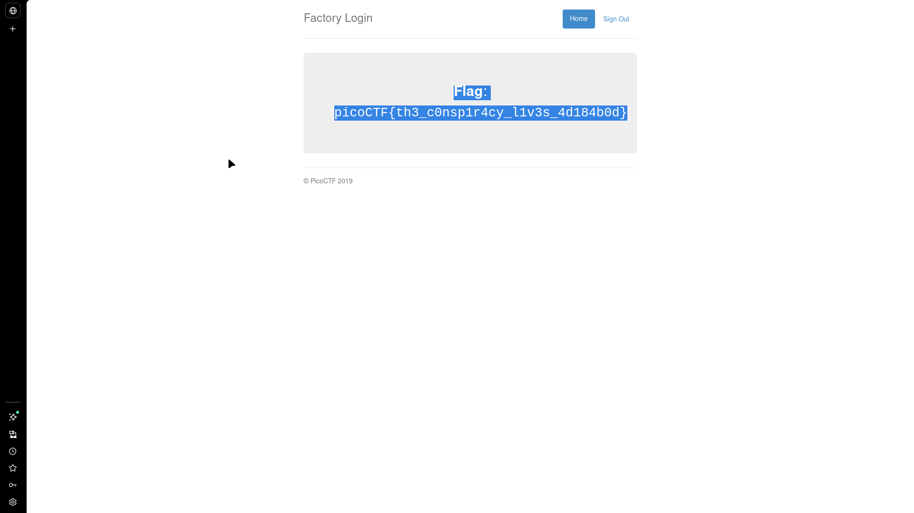
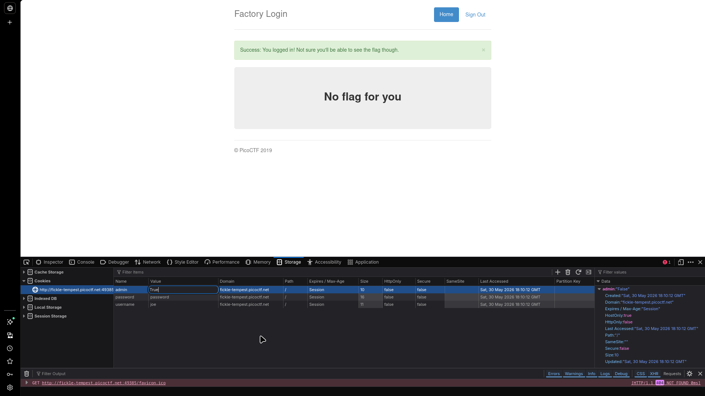

# logon

## Challenge Info

- **Category**: Web Exploitation
- **URL**: `http://fickle-tempest.picoctf.net:49385`
- **Points**: Easy
- **Severity**: Medium
- **Status**: Compromised ✓

## Executive Summary

During a security assessment of the "Factory Login" application, a critical insecure authorization vulnerability was identified. The application relies on a client-side cookie to manage user privileges. By manipulating the `admin` cookie value, an attacker can escalate their privileges and gain unauthorized access to restricted content (the flag).

**Key Finding**: The application trusts client-provided session metadata for authorization decisions, allowing for trivial vertical privilege escalation through manual cookie tampering.

## Challenge Analysis

The application presents a standard login portal for "Factory Login."



Initial testing revealed that the authentication mechanism was largely symbolic; the server accepted any password for any user. However, the challenge hint—*"doesn't seem to check anyone's password, except for Joe's?"*—indicated that the user "Joe" had special properties or was the target for privilege escalation.

## Vulnerability Explanation

### Insecure Authorization (Cookie Tampering)
The application uses a cookie named `admin` to track the authorization level of a logged-in user. When a user logs in, the server sets this cookie to `False` by default. The vulnerability lies in the fact that the server blindly trusts this cookie on subsequent requests without performing any backend verification against a session database or user role registry. Since cookies are stored on the client side, they are fully under the user's control and can be modified to misrepresent the user's identity or privileges.

## Solution / Methodology

### Step 1: Authentication & Reconnaissance
I logged into the portal using the username `Joe` and an arbitrary password. The login was successful, but the application displayed a "No flag for you" message, indicating insufficient privileges.

### Step 2: Cookie Inspection
Using Browser Developer Tools (**Storage** -> **Cookies**), I examined the session metadata. Three cookies were identified: `user`, `password`, and `admin`.



### Step 3: Privilege Escalation
I modified the value of the `admin` cookie directly in the browser:
- **Original Value**: `False`
- **Modified Value**: `True`

### Step 4: Accessing Restricted Content
After modifying the cookie, I refreshed the page. The server processed the request, verified the (manipulated) `admin=True` cookie, and granted administrative access, revealing the flag.

**Captured Flag**: `picoCTF{th3_c0nsp1r4cy_l1v3s_4d184b0d}`

## Alternative Method (CLI)

For automation or headless environments, the same exploit can be executed using `curl`:

```bash
# 1. Perform login and capture the session cookies
curl -c cookies.txt -d "user=Joe&password=anything" http://fickle-tempest.picoctf.net:49385/login -v

# 2. Resend the request with the manipulated admin cookie
curl -b "user=Joe;admin=True" http://fickle-tempest.picoctf.net:49385/ -v
```

## The Real Lesson

This challenge highlights the fundamental risk of **Client-Side Trust**. Authorization decisions should never be based on data that the client can modify.

**Key Learnings**:
1.  **Server-Side Source of Truth**: User roles and privileges must be stored and verified on the server.
2.  **Stateless vs. Stateful Sessions**: If using stateless tokens (like JWTs) in cookies, they must be cryptographically signed by the server to prevent tampering.
3.  **Sanitize All Inputs**: Cookies are user input. Just like form fields or URL parameters, they must be treated as untrusted and potentially malicious.

## Remediation Recommendations

1.  **Implement Robust Session Management**: Transition to a server-side session store where only a random, high-entropy session ID is sent to the client. All role/privilege data should remain on the backend.
2.  **Cryptographic Signing**: If roles must be stored in cookies, use signed cookies (e.g., HMAC) to ensure that any modification by the user invalidates the session.
3.  **Strict HttpOnly & Secure Flags**: Set the `HttpOnly` flag to prevent client-side scripts from accessing cookies and the `Secure` flag to ensure they are only transmitted over HTTPS.

## Tools Used
- Browser Developer Tools (Storage/Cookies Tab)
- `curl` for protocol-level verification

---

*Writeup by Vibhor Prasad | Security Assessment Division*
