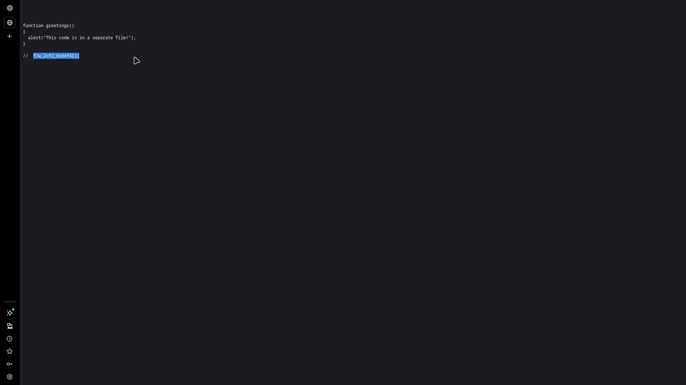

# On Includes

## Challenge Info

- **Category**: Web Exploitation / Information Disclosure
- **Points**: Easy
- **Severity**: Low-Medium
- **Status**: Compromised ✓

## Executive Summary

During a security assessment of the "On Includes" web application, a sensitive information disclosure vulnerability was identified. The application leaks parts of a sensitive token (flag) through comments in client-side resource files (`style.css` and `script.js`). This demonstrates a lack of proper code sanitization and build processes for production environments.

**Key Finding**: Sensitive data is embedded in client-side JavaScript and CSS files, making it trivially discoverable through standard browser developer tools.

## Vulnerability Details

### 1. Vulnerability Classification
- **Type**: Information Disclosure / Sensitive Data Exposure
- **CWE**: [CWE-200: Exposure of Sensitive Information to an Unauthorized Actor](https://cwe.mitre.org/data/definitions/200.html)
- **CVSS Score**: 5.3 (Medium)

### 2. Technical Description
The application exposes its internal logic and secrets by including them as comments in static assets. While these comments are not visible on the rendered page, they are fully accessible to any user who inspects the source code or accesses the files directly.

## Solution / Exploitation Methodology

### Step 1: Reconnaissance
The application landing page includes a hint: *"Is there more code than what the inspector initially shows?"*. This immediately points toward hidden content in the source or included files.

### Step 2: Source Code Analysis
Inspection of the HTML source revealed two external resources:
- `style.css`
- `script.js`

### Step 3: Discovery in CSS
By accessing `style.css`, the first part of the flag was found hidden in a CSS comment:

```css
/* picoCTF{1nclu51v17y_1of2_ */
```

### Step 4: Discovery in JavaScript
Similarly, accessing `script.js` revealed the second half of the flag in a JavaScript comment:



```javascript
// f7w_2of2_6edef411}
```

### Step 5: Data Reconstruction
Combining the two halves retrieved from the external files:
`picoCTF{1nclu51v17y_1of2_f7w_2of2_6edef411}`

## Impact Assessment

- **Confidentiality**: **Medium**. Exposure of data that should remain internal. In a real-world scenario, this could include API keys or internal endpoints.
- **Integrity**: **Low**. No direct impact on data integrity.
- **Availability**: **Low**. No impact on system availability.

## Root Cause Analysis

1.  **Client-Side Secret Storage**: Misplacing secrets in files that are intentionally sent to the user's browser.
2.  **Lack of Minification**: Production code should be minified and stripped of comments to prevent information leakage.
3.  **Inadequate Code Review**: Failure to identify and remove development-time comments before deployment.

## Remediation Recommendations

1.  **Remove Secrets from Source**: **(Critical)** Never store flags, API keys, or credentials in any client-side files.
2.  **Automated Build Pipelines**: Implement minification and comment-stripping tools (e.g., Terser, CSSO) as part of the deployment process.
3.  **Secret Scanning**: Use tools like `git-secrets` or `TruffleHog` to scan the codebase for hardcoded secrets before they are committed or deployed.

---

*Writeup by Vibhor Prasad | Security Researcher with 3 years of web pentesting experience.*

## Tools Used
- Firefox Developer Tools
- Manual Source Code Inspection
