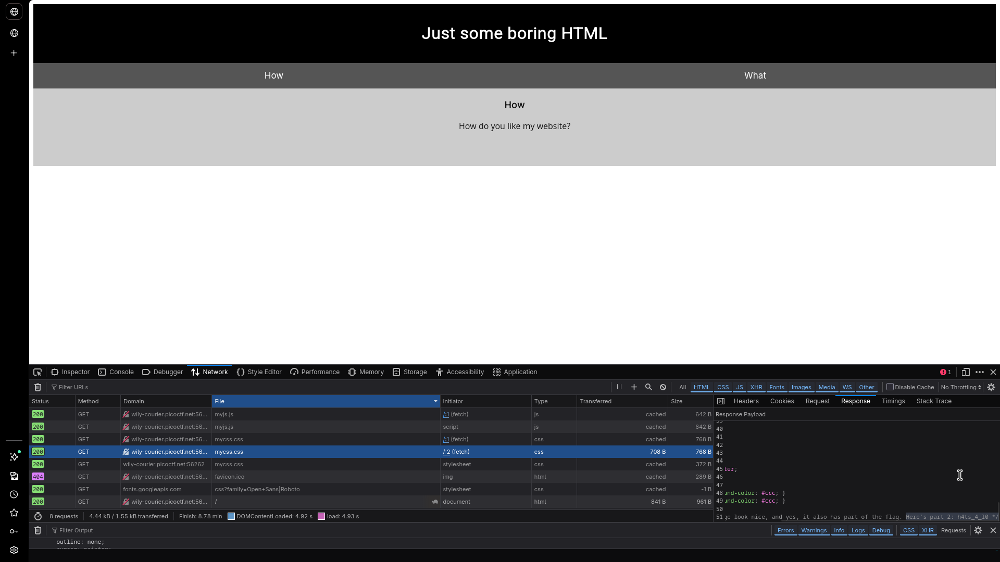
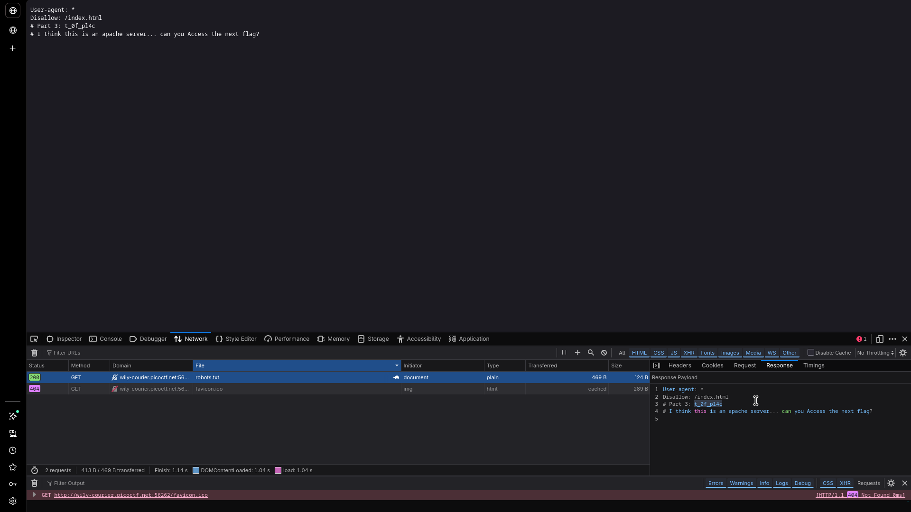
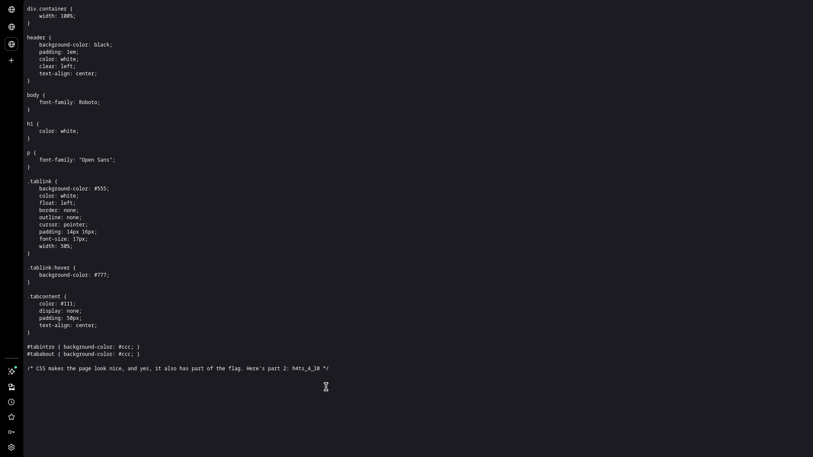
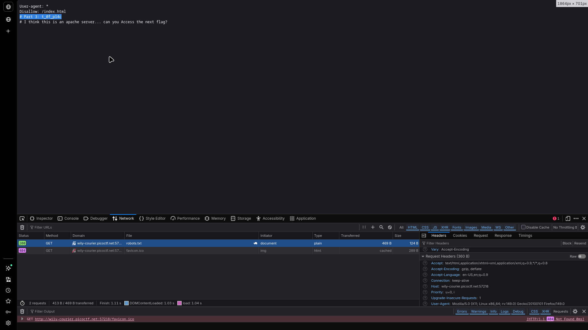
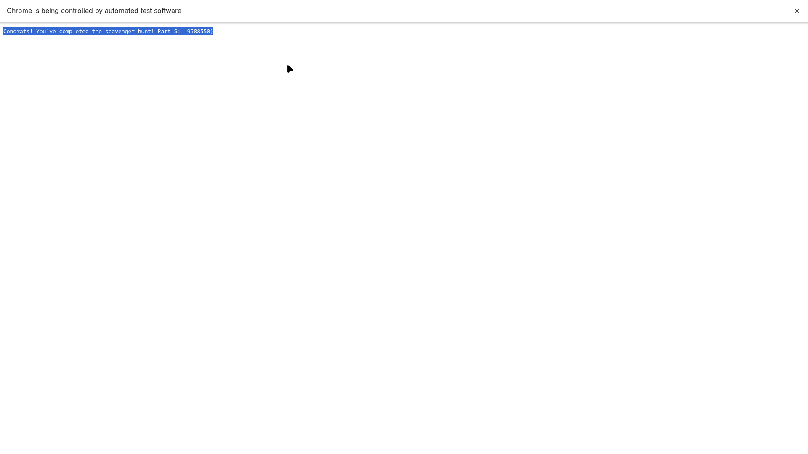

# Scavenger Hunt

## Challenge Info

- **Category**: Web Exploitation
- **URL**: `http://wily-courier.picoctf.net:61627/`
- **Points**: Easy
- **Severity**: Low
- **Status**: Compromised ✓

## Description

The "Scavenger Hunt" challenge is a multi-stage information disclosure exercise. It requires the assessor to systematically investigate common web server configuration files and client-side resources to reconstruct a fragmented flag. This lab highlights the risks associated with improper production sanitization and the exposure of sensitive metadata.

## Solution

### Step 1: Initial Reconnaissance & HTML Inspection
The assessment began with a review of the application's landing page. By inspecting the HTML source code, a hidden comment was identified within the "What" tab section.

- **Finding**: `picoCTF{t` (Part 1 of 5)

### Step 2: CSS Analysis
Next, the linked stylesheet (`mycss.css`) was analyzed. At the conclusion of the CSS rules, the second part of the flag was discovered embedded in a comment.

- **Finding**: `h4ts_4_l0` (Part 2 of 5)

### Step 3: Crawler Directives (robots.txt)
The investigation proceeded to the `/robots.txt` file. This revealed the third fragment and provided a critical hint regarding the server environment (Apache), suggesting an investigation into access control files.

- **Finding**: `t_0f_pl4c` (Part 3 of 5)

### Step 4: Server Configuration (.htaccess)
Following the Apache hint, the `/.htaccess` file was requested. This file, which should typically be restricted from public access, yielded the fourth fragment and a final hint regarding Mac-specific storage metadata.

- **Finding**: `3s_2_lO0k` (Part 4 of 5)

### Step 5: Mac Metadata Analysis (.DS_Store)
Based on the final hint, the `/.DS_Store` file was accessed. This file contained the fifth and final fragment of the flag, confirming the completion of the hunt.

- **Finding**: `_9588550}` (Part 5 of 5)

## Reconstructed Flag

By aggregating all fragments in the order of discovery, the full flag was reconstructed:
`picoCTF{th4ts_4_l0t_0f_pl4c3s_2_lO0k_9588550}`

## The Real Lesson

This challenge serves as a primary example of why **Defense in Depth** is necessary. Storing any part of a secret in publicly accessible comments or configuration files—even if fragmented—is inherently insecure.

**Best Practices for Remediation**:
1.  **Production Sanitization**: Implement build-time tools to automatically strip comments from all client-side assets (HTML, CSS, JS).
2.  **Server Configuration**: Ensure that the web server is configured to deny requests for sensitive files like `.htaccess`, `.DS_Store`, and other metadata files.
3.  **Information Leakage Prevention**: Review `robots.txt` to ensure it does not inadvertently reveal the server's directory structure or technology stack to potential attackers.

## Tools Used
- Browser Developer Tools (Inspector, Network Tab)
- `curl` for direct resource harvesting

---
*Writeup by Vibhor Prasad | Security Assessment Division*
