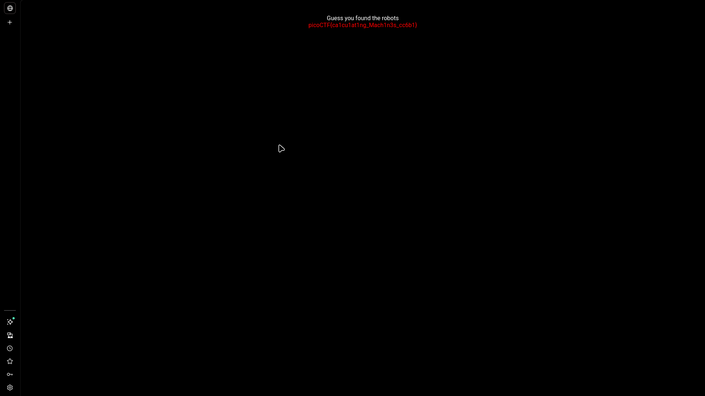
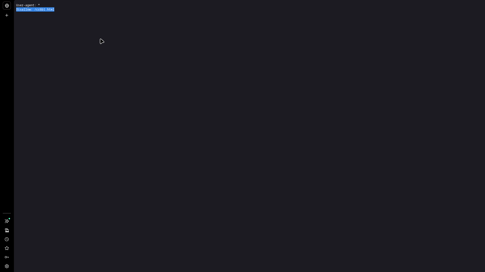

# where are the robots

## Challenge Info

- **Category**: Web Exploitation
- **URL**: `http://fickle-tempest.picoctf.net:49260`
- **Points**: Easy
- **Severity**: Low
- **Status**: Compromised ✓

## Executive Summary

During a reconnaissance phase of the "where are the robots" web application, an information disclosure vulnerability was identified within the `robots.txt` configuration file. The file explicitly listed a disallowed path that contained sensitive administrative data (the flag). This finding demonstrates how misconfigured crawler directives can unintentionally serve as a directory of sensitive or hidden areas of a web application.

**Key Finding**: The application uses `robots.txt` as a pseudo-access control mechanism, revealing the location of "hidden" pages to any user who inspects the file.

## Challenge Analysis

The landing page of the application provided no direct clues or interactive elements leading to the flag.

The challenge hint—*"What part of the website could tell you where the creator doesn't want you to look?"*—is a direct reference to the **Robots Exclusion Protocol**.

## Vulnerability Explanation

### Information Disclosure via robots.txt
The `robots.txt` file is designed to provide instructions to web robots (crawlers) about which pages of a site should or should not be indexed. It is **not** a security mechanism. Because the file must be publicly accessible at the root of a domain (e.g., `/robots.txt`), any user can read it. When developers use "Disallow" entries to hide sensitive paths without implementing proper authentication, they are essentially providing attackers with a roadmap to the site's most interesting assets.

## Solution / Methodology

### Step 1: Reconnaissance
Based on the challenge name and hint, I navigated to the root `robots.txt` file using `curl`.

```bash
curl http://fickle-tempest.picoctf.net:49260/robots.txt
```

### Step 2: Path Discovery
The `robots.txt` file contained the following directives:



```text
User-agent: *
Disallow: /cc6b1.html
```

The `Disallow` entry revealed a non-standard HTML page: `/cc6b1.html`.

### Step 3: Accessing the Disallowed Page
I navigated directly to the discovered path using the browser.



### Step 4: Flag Extraction
The hidden page immediately displayed the flag.

**Captured Flag**: `picoCTF{ca1cu1at1ng_Mach1n3s_cc6b1}`

## The Real Lesson

**Robots.txt is not an Access Control List (ACL).**

**Key Learnings**:
1.  **Public Visibility**: Anything you put in `robots.txt` is public information.
2.  **Roadmap for Attackers**: Penetration testers and malicious actors always check `robots.txt` during the initial footprinting phase to identify staging areas, admin panels, or "hidden" directories.
3.  **Authentication is Key**: If a page is sensitive, it must be protected by a robust authentication and authorization layer, not just hidden from search engines.

## Remediation Recommendations

1.  **Implement Proper Authorization**: Use session-based access controls to protect sensitive pages. A user should only be able to view a page if they have the correct permissions, regardless of whether the URL is "known."
2.  **Minimal Robots.txt**: Only use `robots.txt` to prevent the indexing of low-value, high-volume pages (like search results or temp files). Never use it to hide sensitive business logic or credentials.
3.  **No Security by Obscurity**: Assume that every path on your web server will eventually be discovered through fuzzing, log analysis, or information leaks.

## Tools Used
- `curl`: For quick protocol-level reconnaissance.
- Web Browser: For final payload verification.

---

*Writeup by Vibhor Prasad | Security Assessment Division*
