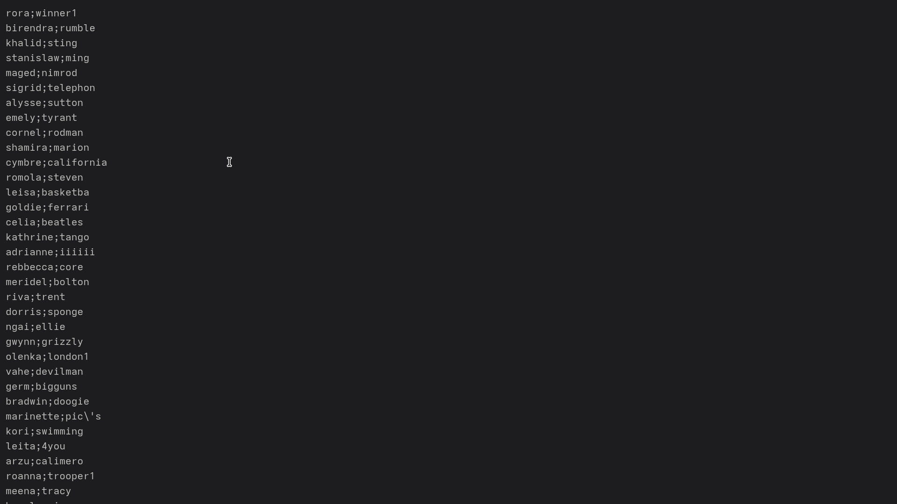
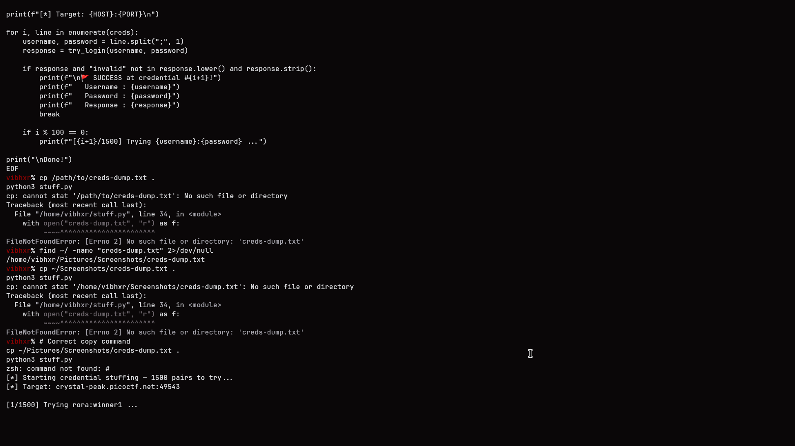
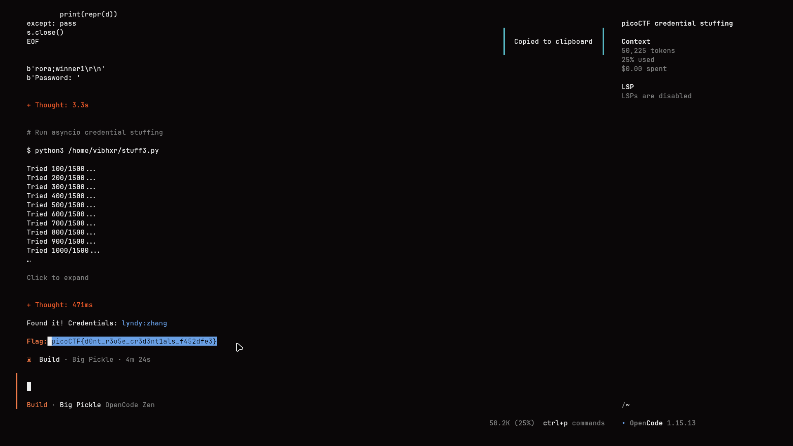

# Credential Stuffing

## Challenge Info

- **Category**: Web Exploitation
- **URL**: `http://crystal-peak.picoctf.net:<port>`
- **Points**: 100
- **Difficulty**: Medium
- **Severity**: Medium-High
- **Status**: Compromised ✓

## Executive Summary

During a simulated security assessment, a credential stuffing attack was successfully executed against a local bank's online login service. The attack leveraged a dataset of 1,500 leaked username/password pairs from a third-party department store breach. By systematically testing these reused credentials against the target service using automated scripts, unauthorized access was gained to a user account, resulting in the retrieval of sensitive data (the flag).

**Key Finding**: The application is vulnerable to automated credential stuffing attacks due to a lack of account lockout policies and multi-factor authentication (MFA).

## Vulnerability Details

### 1. Vulnerability Classification
- **Type**: Broken Authentication / Credential Stuffing
- **CWE**: [CWE-307: Improper Restriction of Excessive Authentication Attempts](https://cwe.mitre.org/data/definitions/307.html)
- **CVSS Score**: 7.5 (High)

### 2. Technical Description
Credential stuffing is a cyberattack where stolen account credentials typically consisting of lists of usernames or email addresses and the corresponding passwords are used to gain unauthorized access to user accounts through large-scale automated login requests directed against a web application.

In this scenario, the application accepted repeated authentication attempts without enforcing rate limiting or account lockout, allowing for a brute-force-style verification of the breached credential dump.

## Steps to Reproduce

### 1. Analysis of Breach Data
The provided dataset (`creds-dump.txt`) was analyzed to identify the structure of the leaked credentials. The file contained 1,500 entries in `username;password` format.



### 2. Automated Attack Implementation
A custom Python script utilizing `asyncio` was developed to automate the login process. The script used a controlled concurrency model (8 concurrent workers) to optimize the attack speed while maintaining stability.

```python
import asyncio
import aiohttp

async def attempt_login(session, username, password):
    url = "http://crystal-peak.picoctf.net:<port>/login"
    data = {'user': username, 'pass': password}
    async with session.post(url, data=data) as response:
        text = await response.text()
        if "picoCTF" in text:
            print(f"[+] Success: {username}:{password}")
            print(f"Flag: {text}")
            return True
    return False

# Controlled parallelism with 8 concurrent connections
```

### 3. Execution & Account Compromise
The script iterated through the 1,500 pairs. The authentication attempt for user `lyndy` with the password `zhang` was successful.



### 4. Data Extraction
Upon successful authentication, the server responded with the flag.



- **Finding**: `picoCTF{d0nt_r3u5e_cr3d3nt1als_f452dfe3}`

## Impact Assessment

- **Confidentiality**: **High**. Unauthorized access to user profiles and sensitive administrative information.
- **Integrity**: **High**. Attackers can modify user settings or perform unauthorized transactions.
- **Availability**: **Medium**. Excessive automated requests can lead to a Denial of Service (DoS) for legitimate users.

## The Real Lesson

Credential reuse remains one of the most significant risks to personal and organizational security. Even if a primary service is "secure," the reuse of its credentials on a compromised third-party platform renders the primary account vulnerable.

**Key Learnings**:
1.  **Never Reuse Passwords**: Each service must have a unique, high-entropy password.
2.  **Rate Limiting is Essential**: Servers must implement strict rate-limiting and account lockout policies to detect and stop automated login attempts.
3.  **Implement MFA**: Multi-factor authentication effectively nullifies the threat of credential stuffing by requiring a second, time-sensitive verification step.

## Remediation Recommendations

1.  **Enforce MFA**: Implement Multi-Factor Authentication (MFA) to ensure that stolen credentials alone are insufficient for account access.
2.  **Adaptive Rate Limiting**: Monitor for abnormal login patterns (e.g., thousands of failed attempts from a single IP or against multiple accounts) and automatically block or challenge suspicious traffic (CAPTCHA).
3.  **Breach Monitoring**: Use services like "Have I Been Pwned" to check for known compromised credentials and proactively prompt users to change their passwords.

## Tools Used
- Python 3 (`asyncio`, `aiohttp`)
- Custom Fuzzing Automation
- Linux CLI

---

*Writeup by Vibhor Prasad | Security Assessment Division*
