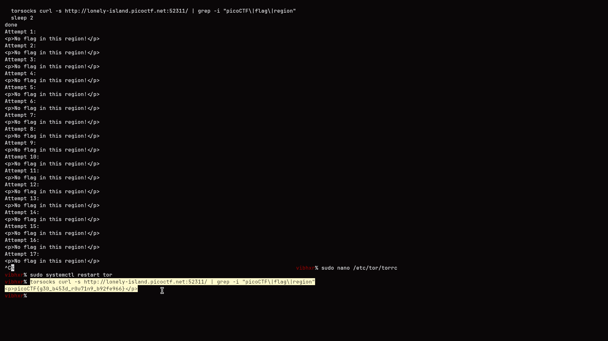
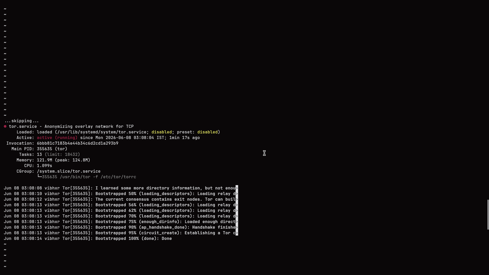

# Challenge: North-South
**Category:** Web Exploitation
**Difficulty:** Medium
**Points:** 100
**Author:** Darkraicg492

---

## Description
The challenge presented a web server performing geo-based routing using Nginx's `ngx_http_geoip2_module` with a MaxMind GeoLite2 database. The server routed requests to one of two upstream backends based on the visitor's country code — Iceland (IS) was routed to port 9000 (the flag server), while all other countries were routed to port 8000 which returned "No flag in this region."


## Approach

### 1. Analysis
Downloaded and analyzed the provided `nginx.conf` — identified `geoip2` module reading real connection IP against `GeoLite2-Country.mmdb`, checking for country code `IS`. Since GeoIP2 reads the actual connection IP (not headers), `X-Forwarded-For` spoofing was ineffective.



### 2. Bypass via Tor
To bypass this restriction, I configured Tor with a forced Icelandic exit node. By editing `/etc/tor/torrc`:

```bash
ExitNodes {IS}
StrictNodes 1
```

I then restarted the Tor service and verified it bootstrapped correctly.



### 3. Exploitation
Routed `curl` through Tor using `torsocks`, making the request appear to originate from Iceland:

```bash
torsocks curl http://lonely-island.picoctf.net:PORT/
```

This successfully routed the request to the flag server backend.

---

## Flag
`picoCTF{g30_b453d_r0u71n9_b92fe966}`

## Key Takeaway
GeoIP-based access control is bypassable via VPNs, proxies, or Tor exit nodes from the target region — it's not a reliable security boundary when the backend relies solely on the source IP of the connection.
