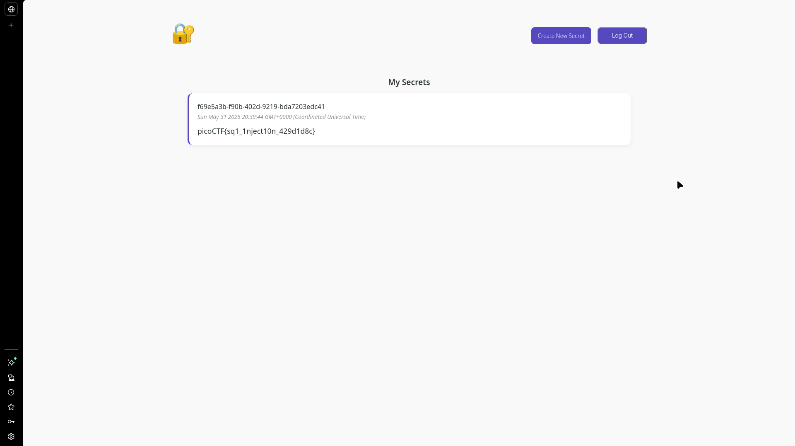
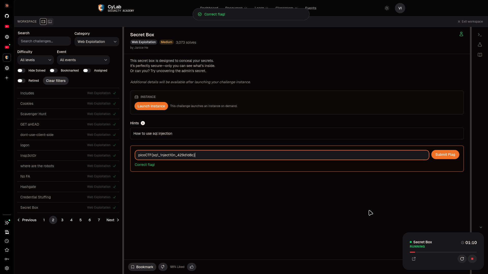

# Secret Box

## Challenge Info

- **Category**: Web Exploitation
- **Points**: 100
- **Difficulty**: Medium
- **Severity**: High
- **Status**: Compromised ✓

## Executive Summary

During a security assessment of the "Secret Box" web application, a critical **SQL Injection (SQLi)** vulnerability was identified in the "create secret" functionality. The application improperly uses string interpolation to build SQL queries, allowing an attacker to inject arbitrary SQL commands. By leveraging a subquery within an `INSERT` statement, I was able to exfiltrate sensitive data belonging to the administrative user, specifically the hidden flag.

**Key Finding**: The application is vulnerable to persistent SQL injection due to the lack of parameterized queries, enabling unauthorized data extraction from the backend database.

## Vulnerability Details

### 1. Vulnerability Classification
- **Type**: SQL Injection (SQLi)
- **CWE**: [CWE-89: Improper Neutralization of Special Elements used in an SQL Command](https://cwe.mitre.org/data/definitions/89.html)
- **CVSS Score**: 8.8 (High)

### 2. Technical Description
The vulnerability resides in the `server.js` file (lines 131-133), where the application handles the creation of new secrets. The user-provided `content` field is directly embedded into a SQL `INSERT` statement using JavaScript template literals:

```javascript
// ❌ VULNERABLE: Direct string interpolation
`INSERT INTO secrets(owner_id, content) VALUES ('${userId}', '${content}')`
```

Because there is no sanitization or escaping of the `${content}` variable, a malicious user can input SQL syntax characters (like `'`, `||`, and `()`) to break out of the intended string context and execute a subquery.

## Steps to Reproduce

### 1. Initial Access
The application requires an account to view and create secrets. 
- **Action**: Register a new user at `/signup` and log in via `/login`.

### 2. Identifying the Attack Vector
Navigate to the "Create Secret" feature. This interface sends a `POST` request to `/secrets/create`.



### 3. Crafting the Payload
To extract the admin's secret, a payload was crafted to terminate the current string, concatenate a subquery, and satisfy the remaining SQL syntax:

- **Payload**: `' || (SELECT content FROM secrets WHERE owner_id = 'e2a66f7d-2ce6-4861-b4aa-be8e069601cb') || '`

**How it works**:
- The first `'` closes the opening quote of the `content` value.
- `||` is the standard SQL string concatenation operator.
- `(SELECT content FROM secrets WHERE owner_id = '...')` is a subquery that retrieves the admin's secret.
- The final `|| '` concatenates the subquery result with the closing quote provided by the original code.

### 4. Execution & Extraction
Submit the payload as the "content" of a new secret. Navigate back to the secrets dashboard (the root path `/`).



- **Result**: Instead of the literal payload, the application displayed the result of the subquery: the administrative flag.
- **Finding**: `picoCTF{sq1_1nject10n_429d1d8c}`

## Impact Assessment

- **Confidentiality**: **High**. Unauthorized access to any user's "secret" data, including administrative credentials and flags.
- **Integrity**: **High**. An attacker could potentially modify or delete secrets of other users or the admin.
- **Availability**: **Medium**. Potential for database disruption through advanced SQLi techniques (e.g., dropping tables).

## The Real Lesson

This challenge highlights the severe risk of **String Interpolation in SQL Queries**. Even in modern environments like Node.js, failing to use prepared statements leads to trivial exploitation.

**Key Learnings**:
1.  **Obscurity is not Security**: Hiding the admin's `owner_id` or making the URL opaque does not protect against a database-level leak.
2.  **Concatenation is Dangerous**: Using operators like `||` within an `INSERT` or `UPDATE` statement is a powerful way to exfiltrate data from other rows.
3.  **ORM/Query Builder Misuse**: Even when using a library, developers must ensure they are using the **parameterized binding** features rather than raw string building.

## Remediation Recommendations

1.  **Use Parameterized Queries**: **(Critical)** Always use prepared statements or parameterized bindings. This ensures the database treats user input as data only, never as executable code.
    - **Secure Example**: `db.run("INSERT INTO secrets(owner_id, content) VALUES (?, ?)", [userId, content])`
2.  **Input Validation**: Implement strict allow-lists and length limits for the `content` field.
3.  **Principle of Least Privilege**: Ensure the database user account used by the application has the minimum necessary permissions (e.g., cannot drop tables or access system schemas).

---

*Writeup by Vibhor Prasad | Security Assessment Division*
