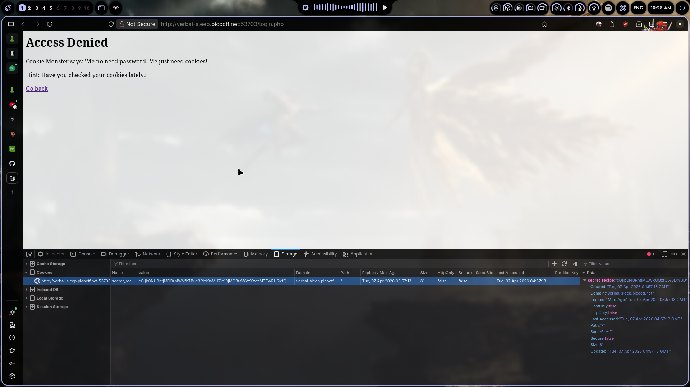
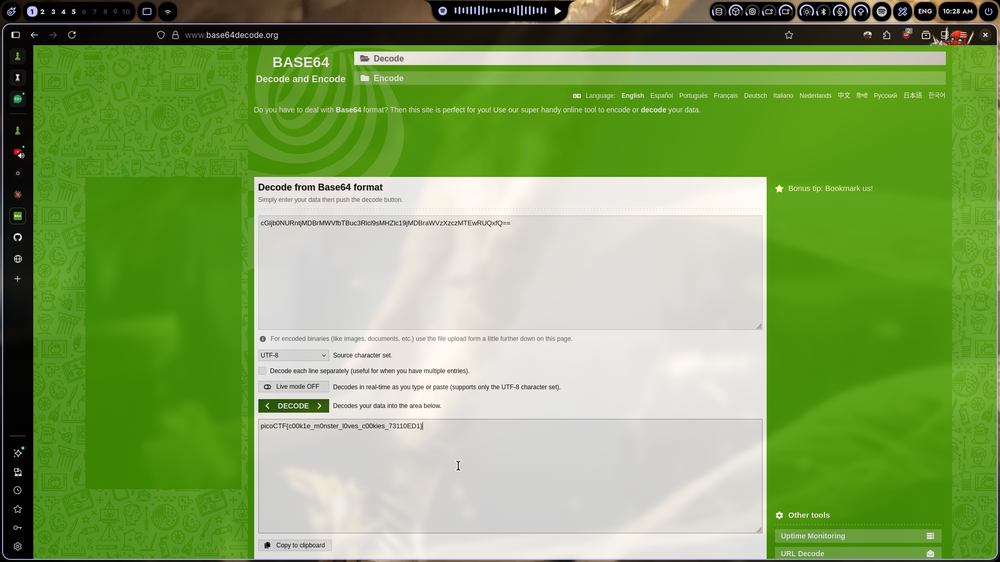

# Cookies

## Challenge Info

- **Category**: Web Exploitation
- **URL**: `http://verbal-sleep.picoctf.net:53703/login.php`
- **Points**: Easy

## Description

Got hit with an "Access Denied" page. Cookie Monster says he doesn't need a password — just cookies. The hint literally tells us: "Have you checked your cookies lately?"

## Solution

### Step 1: Open the Challenge
Went to the URL and saw the access denied page. The hint was basically screaming at us — check the cookies.

### Step 2: Check the Cookies
Opened Firefox Developer Tools → **Storage** tab → **Cookies**. Found a cookie called `secret_recipe` with a base64-encoded value:



```
cGijbONURntjMD BrMWVfbTBuc3Rlcl9sMHZlc19jMDBraWVzX3p3MT EwRUQxfQ==
```

### Step 3: Decode the Base64
Pasted it into a base64 decoder and got the flag directly:

```
picoCTF{c00k1e_m0nster_l0ves_c00kies_73110ED1}
```

That's it. No manipulation needed, no cookie editing, just decode and done.

### Step 4: Flag Submitted
Copied the decoded flag and submitted. Challenge solved.



## The Real Lesson

Sometimes CTF challenges are exactly what they sound like. The hint said check cookies, the cookie had the flag encoded. No fancy exploitation, no bypass — just recognize base64 and decode it.

That said, in real pentests, cookies are always worth checking:
- Session tokens that can be forged
- Encrypted data with weak keys
- Sensitive info developers forgot to hide
- Cookie flags missing (`HttpOnly`, `Secure`, `SameSite`)

This was the easy version. Real cookie vulns are rarely this straightforward.

## Tools Used

- Firefox Developer Tools — Storage tab to inspect cookies
- Base64 decoder — any online tool or Burp Decoder works

## Screenshot


---

*Writeup by vibhxr | 2-3 years deep in pentesting, still learning every day*
