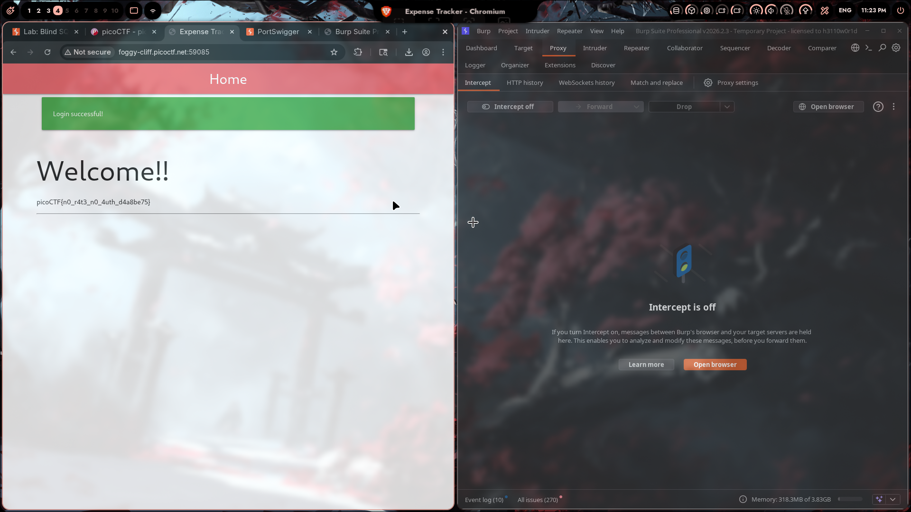

# Expense Tracker

## Challenge Info

- **Category**: Web Exploitation
- **URL**: `http://foggy-cliff.picoctf.net:59085`
- **Points**: TBD

## Description

A web-based expense tracker application that requires authentication.

## Solution

### Step 1: Reconnaissance

The challenge presents us with a web application that appears to require login credentials. The application is running at `foggy-cliff.picoctf.net:59085`.

### Step 2: Analysis with Burp Suite

Using Burp Suite as our proxy, we intercepted and analyzed the HTTP requests between the browser and the server.

**Key Observation**: The application lacked proper rate limiting and authentication checks.

### Step 3: Exploitation

The vulnerability exploited was related to:
- **No Rate Limiting**: The application did not implement proper rate limiting on authentication endpoints
- **Authentication Bypass**: The "no rate no auth" vulnerability allowed us to bypass normal authentication flows

By manipulating the requests through Burp Suite, we were able to gain unauthorized access to the application.

### Step 4: Flag Retrieval

After successfully bypassing authentication, we were greeted with a "Login successful!" message and the flag was displayed on the welcome page.

## Flag

```
picoCTF{n0_r4t3_n0_4uth_d4a8be75}
```

## Key Learnings

1. **Rate Limiting is Critical**: Always implement rate limiting on authentication endpoints to prevent brute-force attacks
2. **Authentication Checks**: Server-side authentication must be enforced on every request, not just the login page
3. **Burp Suite**: Essential tool for web application security testing and request manipulation

## Tools Used

- [Burp Suite](https://portswigger.net/burp) - Web application security testing
- Chromium Browser

## Screenshot



---

*Writeup by vibhxr*
