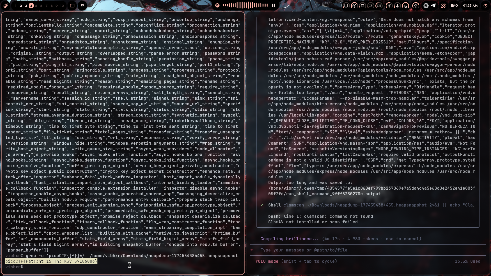
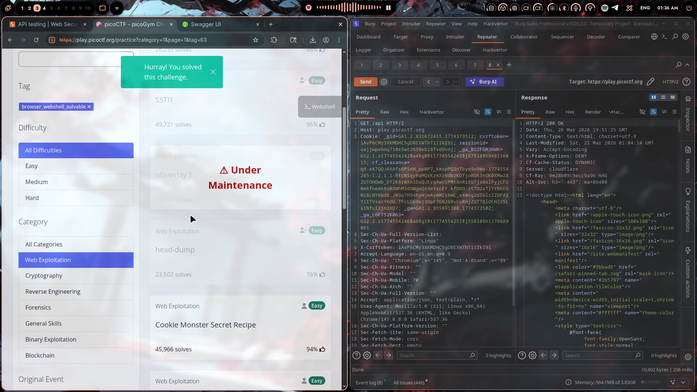

# head-dump

## Challenge Info

- **Category**: Web Exploitation / Forensics
- **Platform**: picoCTF
- **Points**: Easy
- **Date Solved**: March 27, 2026

## Description

Given a heapdump file from a Node.js application. Find the hidden flag.

## Solution

### Step 1: Initial Analysis

Received a heapdump file: `heapdump-1774554384455.heapsnapshot` (11 MB)

Heapdump files are memory snapshots from Node.js applications, commonly used for debugging memory leaks. They're in JSON format and can contain sensitive data that was in memory at the time of the snapshot.

### Step 2: File Type Verification

First, verified the file type:

```bash
file heapdump-1774554384455.heapsnapshot
# Output: ASCII text, with very long lines
```

Confirmed it's a text-based JSON file, not binary.

### Step 3: Searching for the Flag

Since CTF flags typically follow the format `picoCTF{...}`, I used grep to search for the pattern:

```bash
grep -o 'picoCTF{[^}]*}' heapdump-1774554384455.heapsnapshot
```

**Result:**
```
picoCTF{Pat!3nt_15_Th3_K3y_59106086}
```

Flag found! 🎯

### Step 4: Understanding the Vulnerability

This challenge demonstrates a **sensitive data exposure** vulnerability through heap dumps. Here's what likely happened:

1. **Heapdump Generation**: The application was generating heap snapshots (possibly for debugging)
2. **Insecure Storage**: The heapdump file was left accessible (in Downloads folder or publicly accessible)
3. **Data in Memory**: The flag was loaded into memory at some point (perhaps during initialization or validation)
4. **Snapshot Captured**: When the heapdump was taken, the flag was captured in the memory snapshot

### Step 5: Why This Matters

In real-world applications, heapdumps can leak:

| Data Type | Impact |
|-----------|--------|
| API Keys | Unauthorized API access |
| Database Credentials | Data breach |
| Session Tokens | Account takeover |
| Encryption Keys | Data decryption |
| Passwords | Credential compromise |
| PII | Privacy violations |

### Step 6: Verification

Submitted the flag to picoCTF and received the "Hurray! You solved this challenge" confirmation.

## The Real Lesson

This challenge highlights several security concerns:

1. **Debug Artifacts in Production**
   - Heapdumps should NEVER be generated or stored in production
   - If needed for debugging, store them securely and delete immediately after analysis

2. **Sensitive Data in Memory**
   - Avoid loading secrets into memory as plain strings
   - Use secure secret management (environment variables, secret managers)
   - Clear sensitive data from memory after use

3. **Information Disclosure**
   - Any file that contains application state can leak secrets
   - Log files, error reports, memory dumps — all potential goldmines for attackers

4. **Forensic Analysis Skills**
   - CTF challenges often involve analyzing application artifacts
   - Tools like `strings`, `grep`, `jq` are your friends
   - Understanding file formats helps identify where secrets might hide

## Tools Used

- **grep** — Pattern matching to find the flag
- **file** — File type identification
- **Browser DevTools** — Heap snapshot analysis (optional)

## Alternative Analysis Methods

If grep didn't work, you could:

```bash
# View strings in the file
strings heapdump-1774554384455.heapsnapshot | grep picoCTF

# Use jq to parse JSON (if valid)
cat heapdump-1774554384455.heapsnapshot | jq '.strings[]' 2>/dev/null

# Search for common secret patterns
grep -iE 'password|secret|api_key|token|flag' heapdump-1774554384455.heapsnapshot
```

## Remediation (For Real Applications)

1. **Disable heapdump generation in production**
   ```javascript
   // Don't do this in production!
   if (process.env.NODE_ENV === 'development') {
       require('heapdump').writeSnapshot();
   }
   ```

2. **Use secure secret management**
   ```javascript
   // Good: Environment variables
   const apiKey = process.env.API_KEY;
   
   // Better: Secret manager
   const apiKey = await secretsManager.get('api-key');
   ```

3. **Clear sensitive data**
   ```javascript
   // Overwrite buffer after use
   sensitiveBuffer.fill(0);
   ```

4. **Monitor for debug artifacts**
   - Regular security audits
   - File integrity monitoring
   - Automated secret scanning in repositories

## Flag

```
picoCTF{Pat!3nt_15_Th3_K3y_59106086}
```

## Screenshot


*Finding the flag using grep pattern matching*


*Challenge completion confirmation on picoCTF*

---

*Writeup by vibhxr | 2-3 years deep in pentesting, still learning every day*
