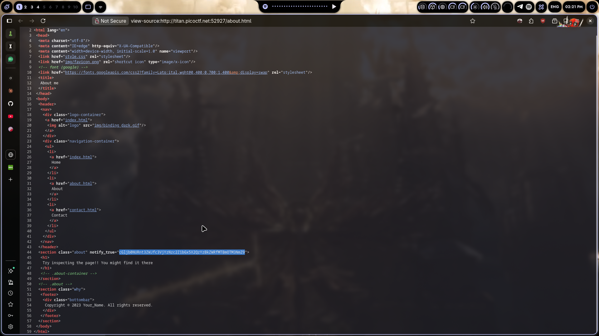
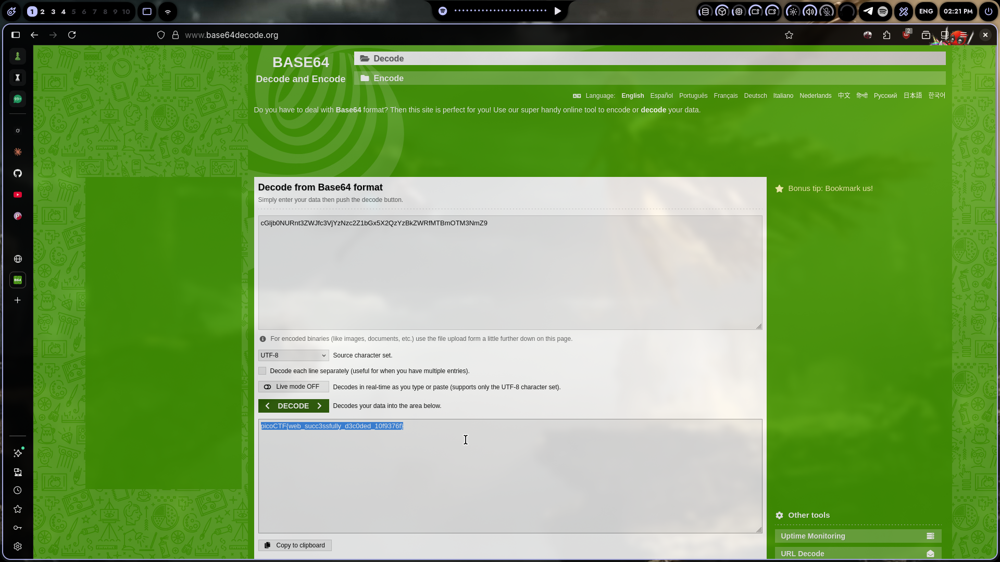

# Inspect HTML

## Challenge Info

- **Category**: Web Exploitation
- **URL**: `http://titan.picoctf.net:52927`
- **Points**: Easy

## Description

The challenge is literally called "Inspect HTML". The page says "Try inspecting the page!! You might find it there." Yeah, that's the entire hint.

## Solution

### Step 1: Open the Challenge
Went to the URL. Saw a basic about page with navigation links. Nothing special on the surface.

### Step 2: View Page Source
Right-clicked → **View Page Source** (or `Ctrl+U`). Scrolled through the HTML and found this on line 44:

```html
<section class="about" notify_true="cGljb0NURnt3ZWJfc3VjYzNzc2Z1bGx5X2QzYzBkZWRfMTA5OTc2fQ==">
    <h1>
    Try inspecting the page!! You might find it there
    </h1>
</section>
```

There's a custom `notify_true` attribute with a base64 string in it.

### Step 3: Decode the Base64
Pasted `cGljb0NURnt3ZWJfc3VjYzNzc2Z1bGx5X2QzYzBkZWRfMTA5OTc2fQ==` into a base64 decoder and got:

```
picoCTF{web_succ3ssfully_d3c0ded_109976}
```

### Step 4: Flag Submitted
Done.



## The Real Lesson

This is basically the CTF version of developers leaving debug data, API keys, or credentials in HTML comments and custom attributes. I've actually seen production sites with:
- Base64-encoded internal data in `data-*` attributes
- Debug comments like `<!-- TODO: remove before prod -->`
- Hidden form fields with sensitive values
- JavaScript variables with backend config

Inspecting source is always step one in web pentesting. Doesn't get more basic than this.

## Tools Used

- Browser View Source (`Ctrl+U`)
- Base64 decoder

## Screenshot



---

*Writeup by vibhxr | 2-3 years deep in pentesting, still learning every day*
