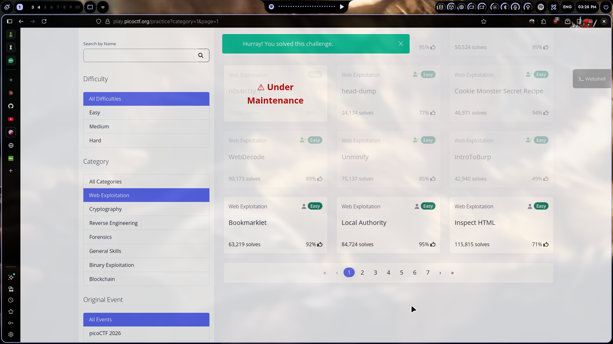
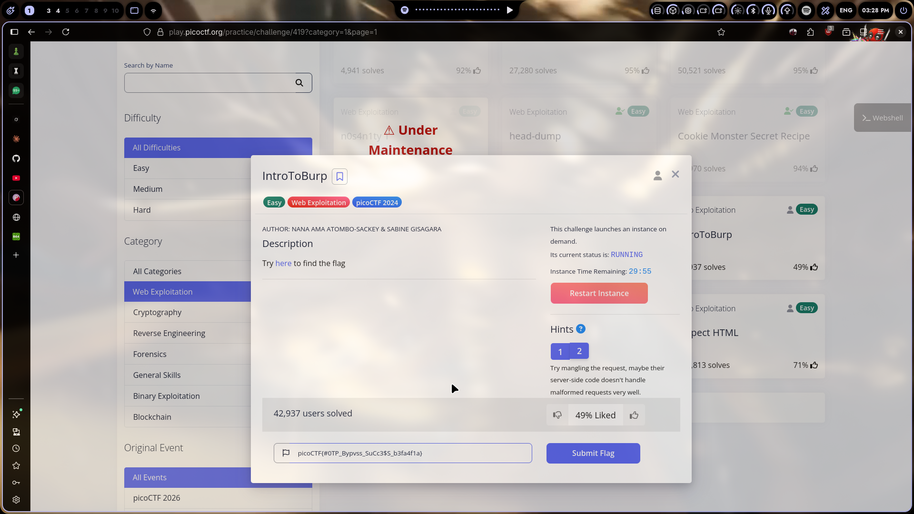

# IntroToBurp

## Challenge Info

- **Category**: Web Exploitation
- **URL**: `http://titan.picoctf.net:{port}/` (dynamic port)
- **Points**: Easy

## Description

The challenge gives us a registration form followed by a 2FA OTP page. The hints say:
1. Try using Burp Suite to intercept requests
2. Try mangling the request — maybe their server-side code doesn't handle malformed requests well

## Solution

### Step 1: Recon the Flow
Opened the challenge and saw a registration form. Filled it out with dummy data and got redirected to a 2FA dashboard asking for an OTP code. No actual OTP was ever sent, so we can't know the correct code.

### Step 2: The Hint Clicked
"Try mangling the request" — this means the server's HTTP parser has a weakness. If we send a malformed request, the backend might not parse it correctly and skip the OTP validation.

### Step 3: The Exploit
Registered an account, then intercepted the OTP POST request. Instead of sending it normally, I sent a raw POST to `/dashboard` **without a `Content-Length` header**:

```http
POST /dashboard HTTP/1.1
Host: titan.picoctf.net:PORT
Cookie: session=...
Content-Type: application/x-www-form-urlencoded

otp=123456
```

The server couldn't figure out where the body ended, so it skipped OTP validation entirely and returned the dashboard with the flag.

### Step 4: Flag Grabbed
```
picoCTF{#0TP_Bypvss_SuCc3$S_b3fa4f1a}
```

Multiple malformed variations also worked:
- **Duplicate Content-Length** headers (different values)
- **TE.CL / CL.TE smuggling** payloads
- **Bare CR** instead of CRLF
- **NUL bytes** in header values
- **Duplicate Host** headers

The Werkzeug/Python backend just doesn't handle non-standard HTTP well.

### Step 5: Submitted
Copied and submitted. Done.



## The Real Lesson

This is a real thing that happens. Python's `http.server` and some WSGI servers are notoriously bad at parsing edge-case HTTP requests. In production, this could mean:
- Bypassing authentication by sending malformed requests
- WAFs that parse differently than the backend (smuggling)
- Request parsing inconsistencies between proxy and app server

Always validate requests properly, and never assume your HTTP parser handles everything the same way the backend does.

## Tools Used

- Burp Suite — Repeater for crafting malformed requests
- Raw socket scripting for quick testing

## Screenshot



---

*Writeup by vibhxr | 2-3 years deep in pentesting, still learning every day*
