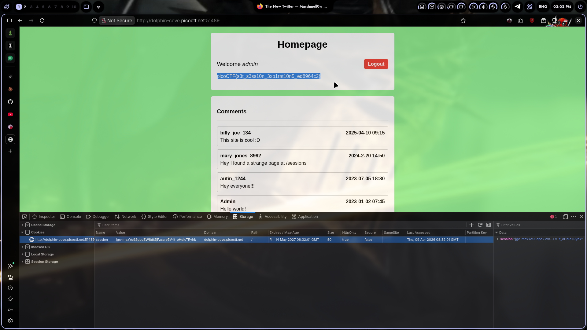
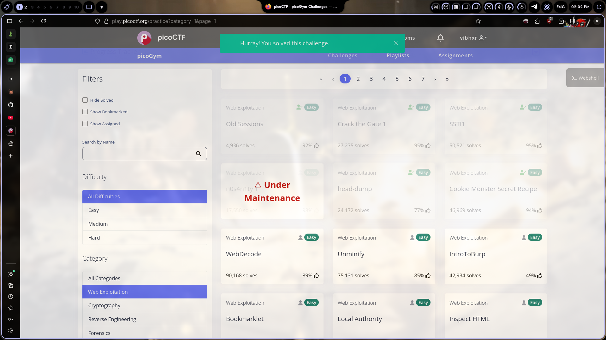

# Old Sessions

## Challenge Info

- **Category**: Web Exploitation
- **URL**: `http://dolphin-cove.picoctf.net:51489`
- **Points**: Easy

## Description

The challenge is called "Old Sessions" and there's a comment on the page mentioning a strange `/sessions` endpoint. The hint is in the name — something about session management is broken.

## Solution

### Step 1: Open the Challenge
Went to the URL and landed on what looks like a social media homepage. Already logged in as **admin** without doing anything. Flag was right there on the page.

### Step 2: Check the Cookies
Opened DevTools → **Storage** → **Cookies**. Found a `session` cookie with a long random value. The cookie had `HttpOnly: true` set.



### Step 3: Investigate the /sessions Endpoint
A comment from `mary_jones_8992` mentioned: "Hey I found a strange page at /sessions". Navigated there but the flag was already visible on the homepage.

### Step 4: What Actually Happened
The app has a session management vulnerability. Old admin sessions were never invalidated, so when a new instance spins up, it reuses an old session token that's still valid. No authentication bypass, no exploit needed — just a broken session lifecycle.

The flag was displayed directly on the admin homepage:
```
picoCTF{s3t_s3ss10n_3xp1rat10n5_ed8964c2}
```

### Step 5: Flag Submitted
Copied and submitted. Done.



## The Real Lesson

This is a real issue that shows up in production all the time. Sessions that never expire, or don't get invalidated on logout, or get reused across instances. In CTFs it's instant flag — in the real world it means someone with an old session token from months ago can still access admin panels.

Common fixes:
- Set session expiration times
- Invalidate sessions on logout
- Rotate session tokens on privilege changes
- Store sessions server-side with TTL

## Tools Used

- Firefox Developer Tools — Storage tab
- Just a browser, honestly

## Screenshot


---

*Writeup by vibhxr | 2-3 years deep in pentesting, still learning every day*
