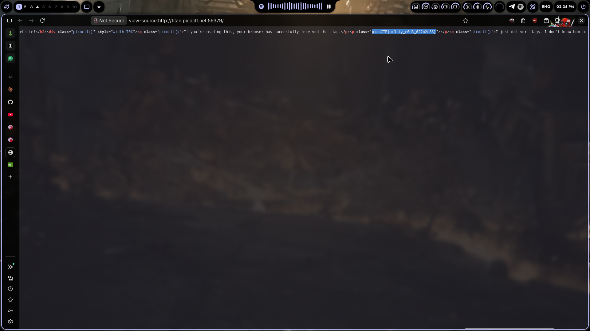
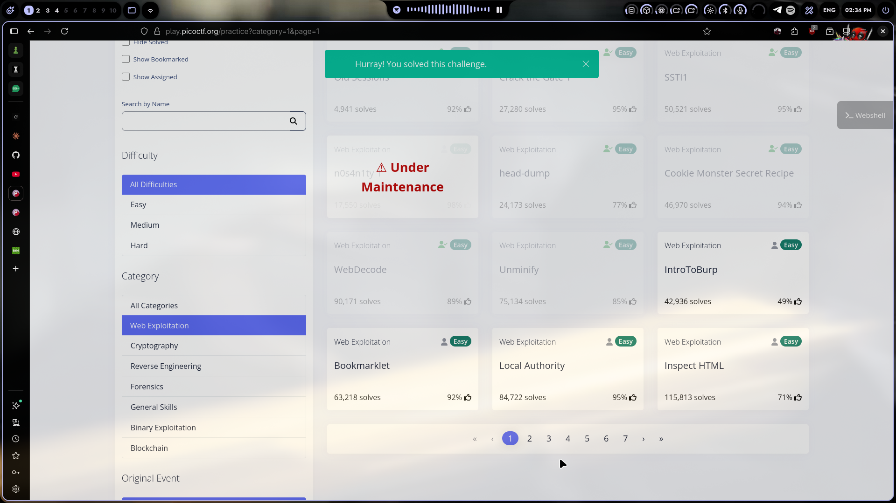

# Pr3tty c0d3

## Challenge Info

- **Category**: Web Exploitation
- **URL**: `http://titan.picoctf.net:56379`
- **Points**: Easy

## Description

A simple web page where the flag is hidden using CSS tricks — likely white text on white background so you can't see it when rendered. But it's right there in the source code.

## Solution

### Step 1: Open the Challenge
Opened the URL. Page looked normal with some text. No flag visible on the rendered page.

### Step 2: View Page Source
Right-clicked → **View Page Source**. Scrolled through the HTML and found the flag hidden inside a `<p>` tag's `class` attribute:

```html
<p class="picoCTF{pr3tty_c0d3_622b2c88}">If you're reading this, your browser has successfully received the flag.</p>
```

The text color was probably set to match the background (white on white), making it invisible on the rendered page. But the source code gives it away instantly.

### Step 3: Flag Grabbed
```
picoCTF{pr3tty_c0d3_622b2c88}
```

### Step 4: Submitted
Copied and submitted. Done.



## The Real Lesson

Hiding content with `color: white; background: white;` or `visibility: hidden;` isn't security — it's decoration. Anyone who views source or inspects the element sees everything. I've seen this in production with:
- Hidden error messages leaking stack traces
- "Invisible" debug panels accessible via CSS tricks
- Admin links with `display: none` that are still in the DOM

If sensitive data is in the HTML, it's already leaked. CSS hiding doesn't fix that.

## Tools Used

- Browser View Source (`Ctrl+U`)
- That's literally it

## Screenshot



---

*Writeup by vibhxr | 2-3 years deep in pentesting, still learning every day*
