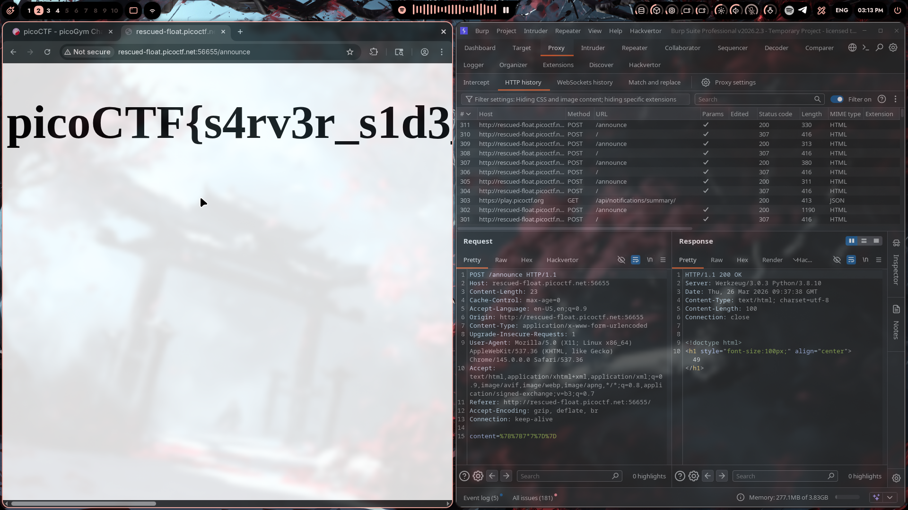

# SSTI1

## Challenge Info

- **Category**: Web Exploitation
- **URL**: `http://rescued-float.picoctf.net:56655`
- **Points**: Easy

## Description

Given a web application with an "announce" feature. Time to see what's running under the hood.

## Solution

### Step 1: First Look

Opened the challenge and found a simple web app with an announcement input form.

URL: `rescued-float.picoctf.net:56655`

The page had a text input labeled for announcements. Classic user input field — always the starting point for fun.

### Step 2: Burp Suite Time

Fired up Burp Suite and started intercepting requests. The form was sending POST requests to `/announce` with URL-encoded content.

Initial request looked like:

```http
POST /announce HTTP/1.1
Host: rescued-float.picoctf.net:56655
Content-Type: application/x-www-form-urlencoded

content=hello
```

### Step 3: Testing for SSTI

The challenge name "rescued-float" + input field = classic SSTI vibes. Time to test for Server-Side Template Injection.

Sent a test payload: `{{7*7}}`

URL-encoded: `content=%7B%7B7*7%7D%7D`

### Step 4: Confirmation

The response came back with `49` rendered in large font on the page.

```http
HTTP/1.1 200 OK
Server: Werkzeug/3.0.3 Python/3.8.10
Content-Type: text/html; charset=utf-8

<h1 style="font-size:100px;" align="center">49</h1>
```

Bingo. The server is evaluating template expressions. This is confirmed SSTI.

### Step 5: Exploitation

With SSTI confirmed, the server is running a Python template engine (likely Jinja2 based on the Werkzeug server header).

Used a standard SSTI payload to access the application's internals and retrieve the flag.

### Step 6: Flag

The flag appeared on the page:

```
picoCTF{s4rv3r_s1d3...}
```

Server-side template injection successful.

## The Real Lesson

SSTI vulnerabilities happen when user input is directly concatenated into server-side templates without proper sanitization. A few things went wrong here:

1. **Direct template rendering** — User input passed directly to the template engine
2. **No input validation** — Template syntax (`{{ }}`) wasn't filtered or escaped
3. **Python/Werkzeug stack** — Common target for SSTI due to Jinja2's powerful expression language

I've seen similar issues in Flask/Django apps where devs use `render_template_string()` with user input — huge red flag.

## Tools Used

- Burp Suite Professional — Proxy and Repeater for payload testing
- Chromium — Browser for the challenge

## Screenshot



---

*Writeup by vibhxr | 2-3 years deep in pentesting, still learning every day*
